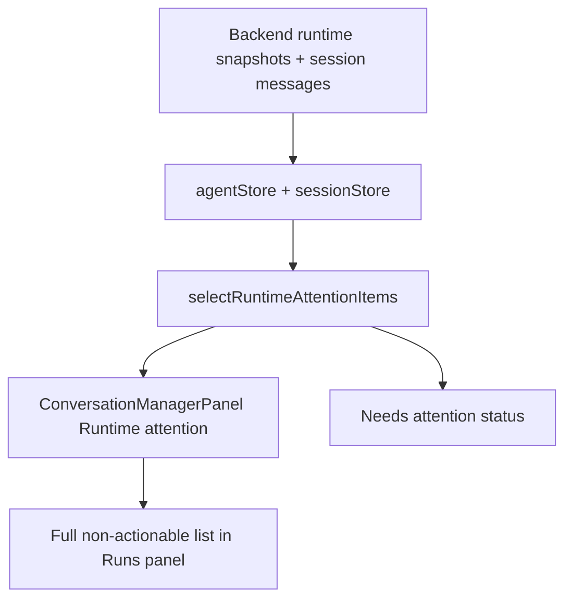
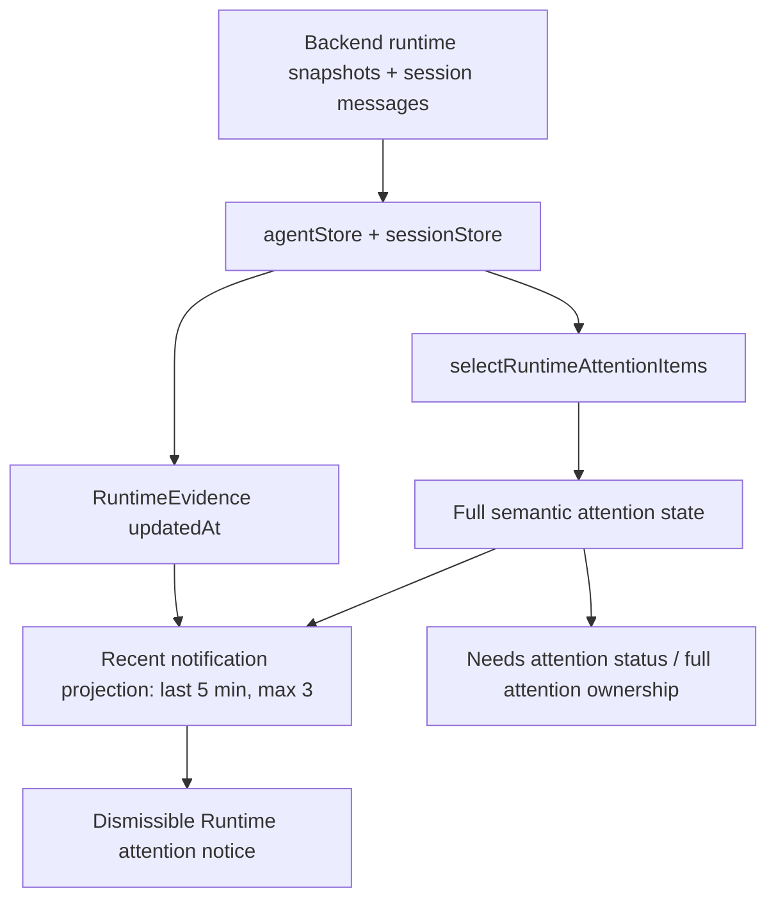
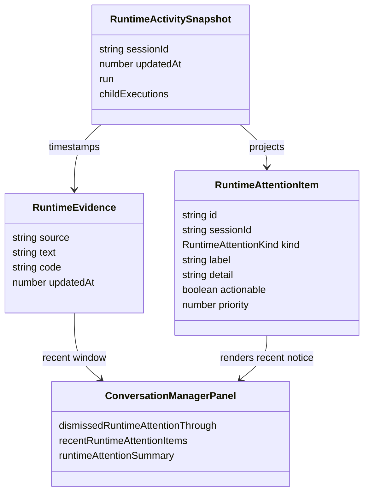

# Runtime Attention Recent Notice

## Goal

Make the Runs panel treat `Runtime attention` as a short-lived notification surface, not as the full runtime error log.

Acceptance criteria:

- Runtime attention notice shows a compact summary for recent non-actionable runtime errors/waits.
- The notice displays only the latest few items.
- A close button hides the current notice without removing the underlying `Needs attention` state.
- Recent notice items expire after a few minutes; the full attention list remains owned by selectors/log/audit flows.
- Existing runtime attention selector remains the shared semantic source of truth.

## Current Architecture

## Target Architecture

## Affected Models

## Implementation Plan

- [x] Add focused failing tests for compact recent runtime notice, dismiss behavior, and full `Needs attention` preservation.
- [x] Add `updatedAt` to runtime evidence and derive recent notice timestamps from evidence, snapshots, or sessions without changing `RuntimeAttentionItem` exact shape.
- [x] Replace full `Runtime attention` list in `ConversationManagerPanel` with a recent, limited, dismissible notice.
- [x] Keep status/count behavior driven by full `attentionItems`.
- [x] Run focused tests and affected typecheck/build if practical.
- [x] Add session notes for the runtime attention frontend projection change.

## Notes

- User clarified through screenshot and prompt that this panel is too noisy because it renders repeated runtime errors as a long list.
- Current dirty worktree already includes changes in `ConversationManagerPanel.tsx` and its test around interrupted runtime recovery; this task must preserve them.
- Web references checked on 2026-07-01: React docs current site shows React 19.2; WAI/WCAG guidance supports non-focus-stealing status messages and avoiding frequent or too-fast disappearing alerts.
- 2026-07-01: TDD red confirmed 2 new component tests failed before implementation because `runtime-attention-notice` did not exist.
- 2026-07-01: Implemented `agentRuntimeAttentionNotice.ts` so dismiss only hides notifications through the latest visible timestamp; newer runtime attention can reappear.
- 2026-07-01: Browser plugin failed twice with webview attach timeout. Fallback Playwright orchestrator smoke on managed QA `http://localhost:5288/` passed with zero console/network findings and a nonblank Kalio screenshot.
