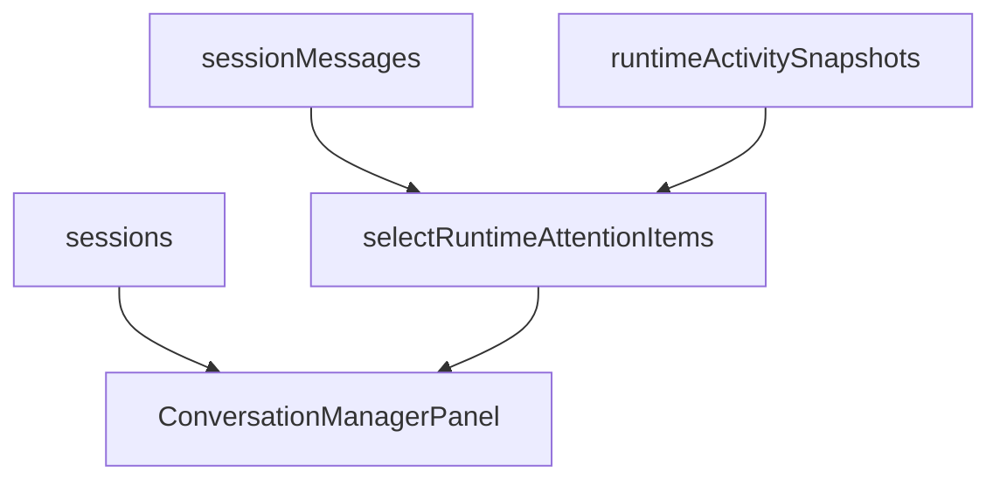
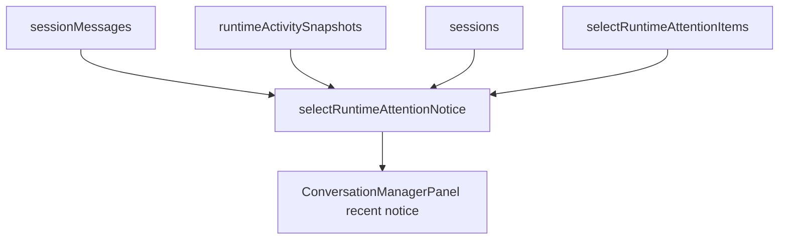
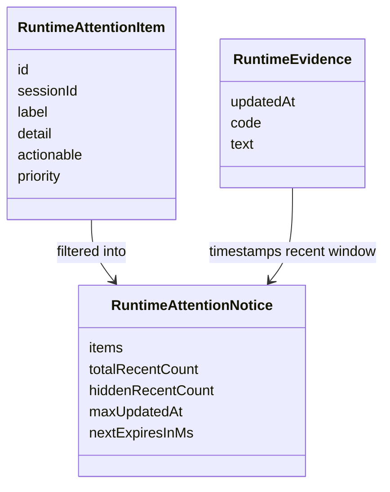

# Test Gap Detection: Runtime Attention Notice

## Goal

Cover untested selector paths introduced by the new recent runtime-attention notice projection without widening scope beyond the touched frontend runtime slice.

## Acceptance Criteria

- Add focused tests for `selectRuntimeAttentionNotice`.
- Verify timestamp fallback order and dismiss-window behavior directly at selector level.
- Run only the affected frontend test file.

## Current Architecture

## Target Architecture

## Affected Models

## Checklist

- [x] Review changed runtime-attention slice and existing component coverage.
- [x] Add direct selector tests for timestamp fallback, sorting, and dismiss cutoff.
- [x] Run focused frontend verification.
- [x] Record result and residual nearby gaps.

## Notes

- 2026-07-01: Scope intentionally limited to the new selector module because `ConversationManagerPanel` already gained integration coverage, but `agentRuntimeAttentionNotice.ts` itself still has no direct tests.
- 2026-07-01: No production code change is planned unless the new tests expose a real bug.
- 2026-07-01: Added `apps/kalio-web/src/store/agentRuntimeAttentionNotice.test.ts` covering message/snapshot/session timestamp fallback, dismiss cutoff, and hidden-count limiting.
- 2026-07-01: Focused verification passed with `corepack pnpm --filter kalio-web exec vitest run src/store/agentRuntimeAttentionNotice.test.ts --reporter=verbose` (3 tests).
- 2026-07-01: Residual nearby gap: `registerConnectionRecoveryHandlers` still has only helper-level reconnect coverage, not explicit listener/interval lifecycle assertions.
