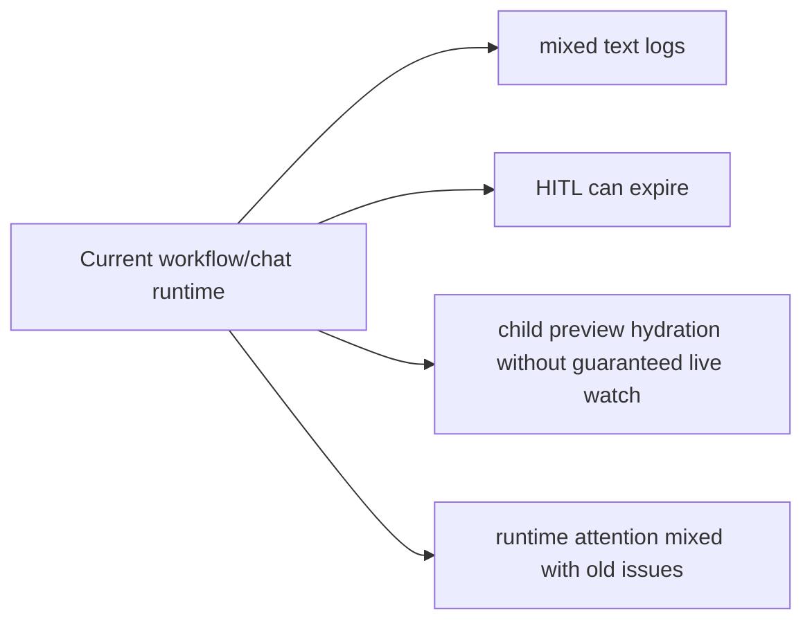
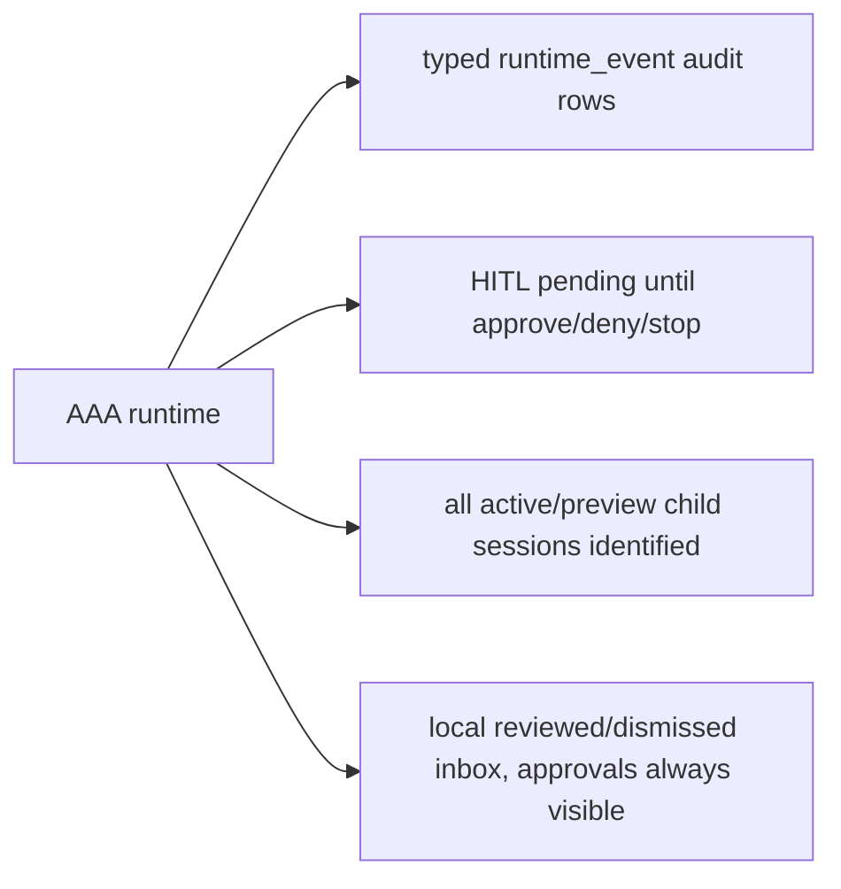
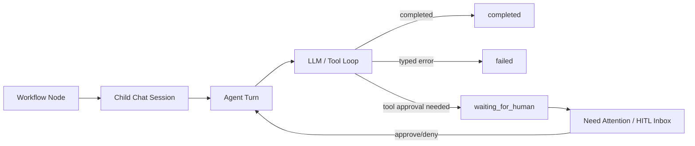
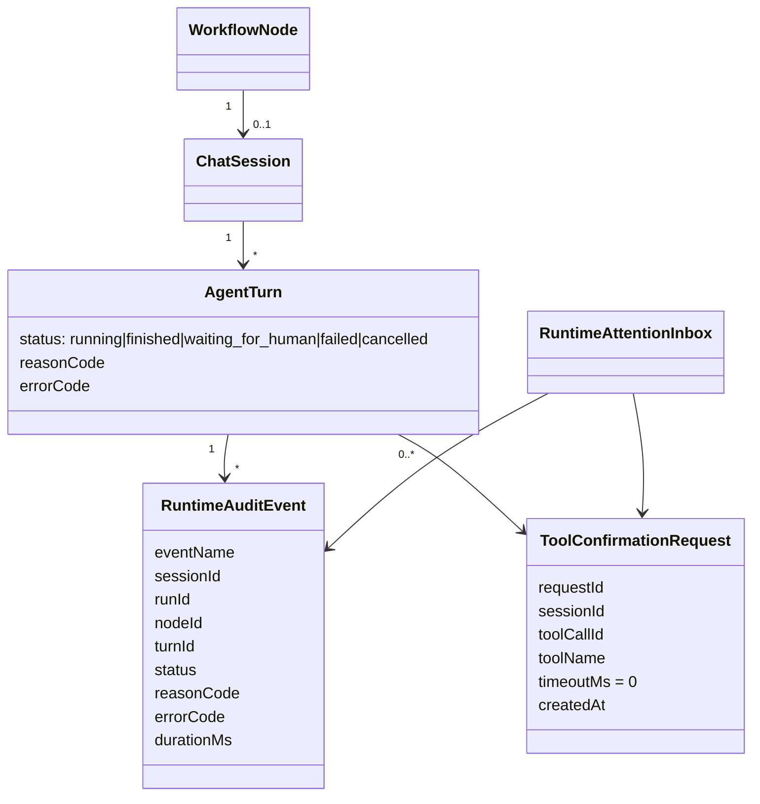

# AAA Workflow Runtime Stability

## Goal

Stabilize workflow/chat runtime so every run is either running, completed, failed, cancelled, or waiting for human approval with typed state, observable logs, and rebuildable frontend projections.

## Current Architecture

## Target Architecture

## Runtime Flow

## Model Relations

## Tasks

- [x] Backend: make manual tool HITL approvals permanent (`timeoutMs: 0`) and end only on approve/deny/abort.
- [x] Backend: stop expiring RA-App pending approvals from `getPendingForSession`; keep timeout config wire-compatible but ineffective for manual waiting.
- [x] Backend: add `runtime_event` audit type and runtime audit logger for typed lifecycle events.
- [x] Frontend: make Need Attention a local reviewed/dismissed inbox where active approvals cannot be dismissed.
- [x] Frontend: ensure sub-conversation activation and previews identify watched sessions deterministically.
- [x] Frontend: render long user/workflow prompts responsively without horizontal overflow.
- [x] Tests: add backend/frontend regressions for HITL, child watch, inbox, formatting, and runtime logs.
- [x] Tests: add pure runtime-audit mapping coverage for typed terminal status and text-free runtime payloads.
- [x] Tests: add durable graph regression proving typed architecture event ids are used and tool-call ids remain opaque fallbacks.
- [x] Architecture audit: remove remaining HIGH circular dependencies in backend LLM/credentials modules and frontend RA-App catalog views.
- [x] Backend/API: add scoped session-tree reads for workflow tests (`GET /api/sessions/:id`, `GET /api/sessions/:id/children`) so runtime proof does not depend on global `/api/sessions`.
- [x] E2E: make architecture workflow proof use scoped child-session traversal and retry only transport-level API resets during live workflow polling.
- [x] E2E: update seeded chat ordering/canvas-preview fixture to use durable `turn_id` + `prompt_message_id` linkage instead of legacy chronological turn inference.
- [x] Tests/UI runtime: add multi-run workflow envelope reload regression so follow-up workflows in one host chat survive F5/reconnect as separate turns.
- [x] Release gate: refresh built frontend `runtime-config.js` from the active managed QA stack before Playwright browser checks, so random-port FE/BE and Socket.IO connections do not depend on stale static port pairing.
- [x] Tests: run existing Playwright workflow-release gate for child replay, reconnect/hydration, stop/HITL, and normal chat.
- [x] Tests: add Playwright regression for malformed router structured-output failure.
- [x] Tests: add/complete additional Playwright regression for RA-App HITL.
- [x] Verification: run focused tests, typecheck, direct package build, audit report, and `release:workflow-gate`.
- [x] Verification: restore root `npm.cmd run test` / root `npm.cmd run build`.
- [ ] Verification: complete full `npm.cmd run test:e2e`.

## Notes

- 2026-07-01: User chose local browser persistence for Need Attention reviewed/cleared state.
- 2026-07-01: User required HITL approvals to wait indefinitely. Execution timeouts for LLM/CLI/subagent remain valid failure guards.
- 2026-07-01: Implemented backend and frontend unit coverage. Root `npm.cmd run test` and root `npm.cmd run build` were blocked in `@kalio/sdk` by nested pnpm frozen patchedDependencies mismatch; direct builds for touched packages passed.
- 2026-07-01: `npm.cmd run release:workflow-gate` passed after fixing Canvas focused branch transcript preload. Full `npm.cmd run test:e2e` timed out at 244s in this runner.
- 2026-07-01: Added runtime-audit helper regression coverage for `final_artifact`, max-step router failure, and typed failure summaries.
- 2026-07-01: Removed durable graph state/evidence inference from architecture `toolCall.id` prefixes. Reconstruction now prefers typed `architectureEventId` / `eventId`, treats raw ids as opaque compatibility fallback, and deduplicates node event ids.
- 2026-07-01: Removed all audit HIGH circular dependencies. RA-App shared catalog types moved out of `RAAppManager.Views`; LLM runtime smoke credential endpoints moved into `LLMModule`, leaving `CredentialsModule` as credentials/settings ownership.
- 2026-07-02: Restored root `npm.cmd run build` and `npm.cmd run test` by removing nested package-manager calls from `@kalio/sdk` package scripts. Added a workspace compatibility regression so package scripts used by root gates do not invoke nested `pnpm`.
- 2026-07-02: Updated runtime regression expectations to match the AAA contract: tool-call ids are opaque fallbacks, pending host placeholders must come from the local pending-host API, failed/cancelled architecture runs stop downstream pending nodes, and MCP tool grouping uses typed `serverKey` metadata instead of name-prefix parsing.
- 2026-07-02: `release:workflow-gate` exposed reproducible `ECONNRESET` on Playwright API requests during live workflow proof. Added scoped session/children endpoints and moved the architecture E2E proof off global `/api/sessions`; retained a narrow retry only for retryable transport resets.
- 2026-07-02: Fresh `npm.cmd run release:workflow-gate` passed after scoped session-tree change: council branch replay/reload, reconnect/hydration, stop/HITL, and normal chat.
- 2026-07-02: Fixed the chat ordering/canvas-preview E2E regression by seeding persisted assistant turns with explicit `turn_id` and `prompt_message_id`. The focused official Playwright stack run passed for `regression-chat-ordering-canvas-preview.spec.ts`.
- 2026-07-02: `release:workflow-gate` later exposed a QA config drift: root rebuild restored the public empty `runtime-config.js` while the fixed QA stack continued on random ports. The gate now rewrites the built frontend runtime config from `stack-manager status` before Playwright opens the app; fresh `npm.cmd run release:workflow-gate` passed.
- 2026-07-02: Fixed follow-up architecture workflow reload hydration. The host chat may contain multiple workflow envelopes; reload now collects all persisted `architectureRun` summaries by `runId`, fetches typed projections for each, and keeps durable `turnId` / `promptMessageId` linkage. Focused unit tests, `kalio-web` typecheck, and `architecture-follow-up-stability.spec.ts` passed.
- 2026-07-02: Added malformed router structured-output regression. Mock provider can emit an invalid typed router payload with `[[mock:architecture:router:malformed-output]]`; runtime now persists a typed `CONTRACT_VIOLATION`, graph projection exposes `errorCode/failure` on failed/cancelled nodes, and Timeline renders terminal `failed/cancelled` statuses instead of empty/pending badges.
- 2026-07-02: Fresh Playwright built-stack proof passed for `architecture-structured-output-failure.spec.ts`: failed run, failed router, cancelled finalizer, and graph API `CONTRACT_VIOLATION` all matched the typed projection. The E2E runner still logs non-blocking pnpm install warnings from bundled Node before successful app builds.
- 2026-07-02: Added durable RA-App HITL pending snapshot endpoint (`GET /api/ra-apps/pending-approvals`) and frontend hydration hook. Need Attention now shows RA-App approvals after F5/reconnect even when the transcript is not loaded yet.
- 2026-07-02: RA-App approval actions from global inbox identify the owning session before approve/deny. Inline overlays now also settle from typed `raapp:native_result` (`sessionId` + `results[].id`) so stale pending UI cannot remain after backend execution.
- 2026-07-02: Focused Playwright built-stack proof passed for `hitl-settings-modes.spec.ts`: manual mode reload -> Need Attention RA-App approval -> open -> approve -> overlay removed -> VFS/audit verified, and bypass mode auto-executes without showing overlay.
