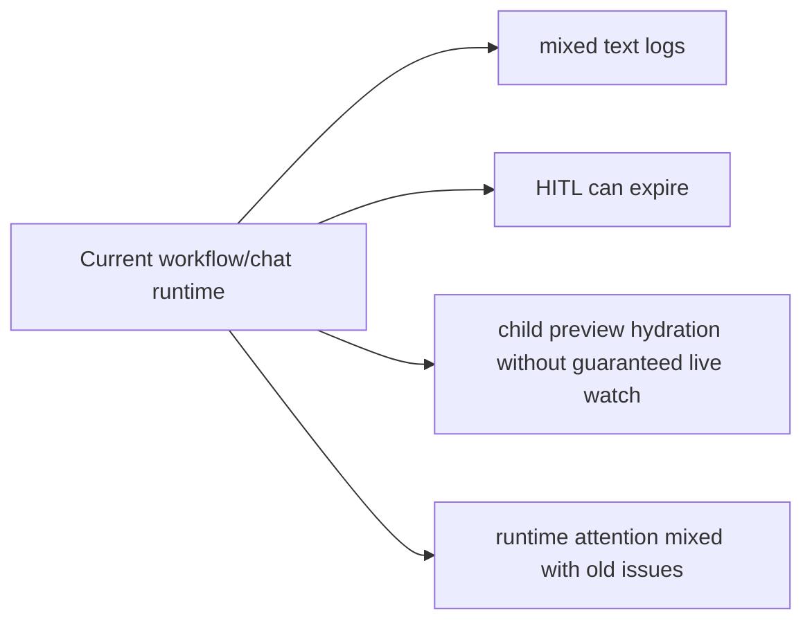
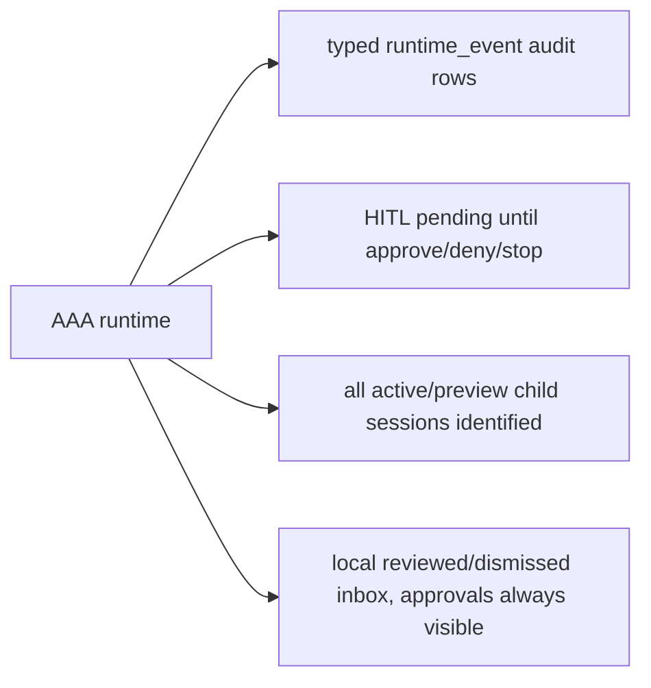
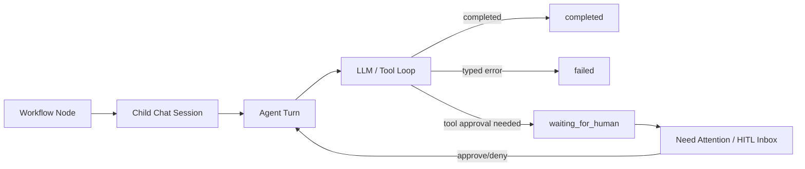
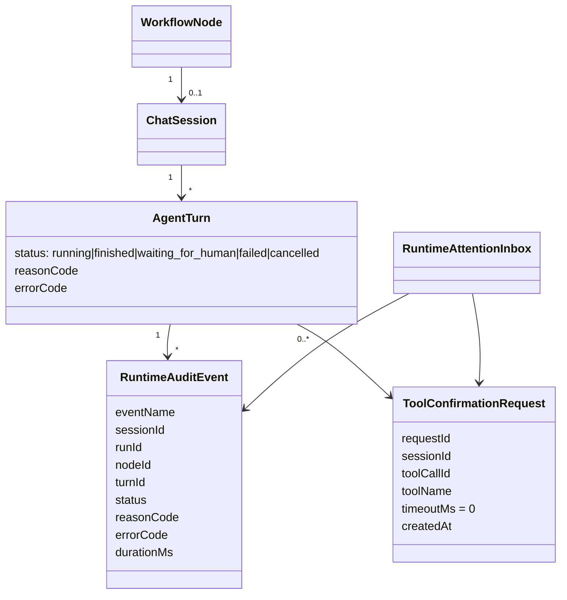

# AAA Workflow Runtime Stability

## Goal

Stabilize workflow/chat runtime so every run is either running, completed, failed, cancelled, or waiting for human approval with typed state, observable logs, and rebuildable frontend projections.

## Current Architecture

## Target Architecture

## Runtime Flow

## Model Relations

## Tasks

- [x] Backend: make manual tool HITL approvals permanent (`timeoutMs: 0`) and end only on approve/deny/abort.
- [x] Backend: stop expiring RA-App pending approvals from `getPendingForSession`; keep timeout config wire-compatible but ineffective for manual waiting.
- [x] Backend: add `runtime_event` audit type and runtime audit logger for typed lifecycle events.
- [x] Frontend: make Need Attention a local reviewed/dismissed inbox where active approvals cannot be dismissed.
- [x] Frontend: ensure sub-conversation activation and previews identify watched sessions deterministically.
- [x] Frontend: render long user/workflow prompts responsively without horizontal overflow.
- [x] Tests: add backend/frontend regressions for HITL, child watch, inbox, formatting, and runtime logs.
- [x] Tests: add pure runtime-audit mapping coverage for typed terminal status and text-free runtime payloads.
- [x] Tests: add durable graph regression proving typed architecture event ids are used and tool-call ids remain opaque fallbacks.
- [x] Architecture audit: remove remaining HIGH circular dependencies in backend LLM/credentials modules and frontend RA-App catalog views.
- [x] Backend/API: add scoped session-tree reads for workflow tests (`GET /api/sessions/:id`, `GET /api/sessions/:id/children`) so runtime proof does not depend on global `/api/sessions`.
- [x] E2E: make architecture workflow proof use scoped child-session traversal and retry only transport-level API resets during live workflow polling.
- [x] E2E: update seeded chat ordering/canvas-preview fixture to use durable `turn_id` + `prompt_message_id` linkage instead of legacy chronological turn inference.
- [x] Tests/UI runtime: add multi-run workflow envelope reload regression so follow-up workflows in one host chat survive F5/reconnect as separate turns.
- [x] Release gate: refresh built frontend `runtime-config.js` from the active managed QA stack before Playwright browser checks, so random-port FE/BE and Socket.IO connections do not depend on stale static port pairing.
- [x] QA stack runtime config: serve `/runtime-config.js` from the running Vite dev/preview process env, leaving shared `dist/runtime-config.js` as a fallback only. Concurrent fixed/random-port stacks must not overwrite each other's API/WS origins.
- [x] Tests: run existing Playwright workflow-release gate for child replay, reconnect/hydration, stop/HITL, and normal chat.
- [x] Tests: add Playwright regression for malformed router structured-output failure.
- [x] Tests: add/complete additional Playwright regression for RA-App HITL.
- [x] Tests: add structured-output schema validator regressions for router contracts and nested validation details.
- [x] Tests: add mock-provider regressions for deterministic `hold(ms)` waits and real dispatcher `tool_result` correlation by `toolCallId`.
- [x] Tests/UI runtime: add focused AgentFlow Canvas regression proving live runtime activity renders before persisted history catches up.
- [x] Release gate: pass managed QA `DATABASE_PATH` into Playwright so browser checks inspect the same runtime DB as the active stack.
- [x] Verification: run focused tests, typecheck, direct package build, audit report, and `release:workflow-gate`.
- [x] Verification: restore root `npm.cmd run test` / root `npm.cmd run build`.
- [x] Backend/runtime: extract architecture graph finalization/materialization checks into a pure helper with direct regression coverage.
- [x] Backend/runtime: extract architecture graph routing selectors into a pure helper with direct regression coverage.
- [x] Backend/runtime: extract architecture branch stream event projection into a pure helper with direct regression coverage.
- [x] Backend/runtime: extract architecture graph topology/resume selectors into a pure helper with direct regression coverage.
- [x] Backend/runtime: extract architecture graph scheduler visit-limit decisions into a pure helper with direct regression coverage.
- [x] Backend/runtime: extract Goal Master judge continuation guard into a pure helper with direct regression coverage.
- [x] Backend/runtime: route `chat:stop` through an `ArchitectureRuntime` stop port so active workflow runs cancel with typed `user_stop`.
- [x] Backend/runtime: keep oversized `run_sub_agentflow` tool results parseable for LLM history by preserving AgentFlow control metadata and omitting heavy trace payloads.
- [x] Tests/E2E: make session-selection helper fail diagnostically on reconnect/transport state instead of misreporting it as a missing sidebar session.
- [x] Verification: rerun full workflow release gate on a freshly rebuilt mock QA stack after the E2E helper and malformed structured-output assertion fixes.
- [x] Verification: complete full `npm.cmd run test:e2e`.
- [x] Verification: complete manual real-browser workflow smoke on fixed QA stack for successful workflow and malformed structured-output failure.
- [x] Release gate: start from a fresh mock QA stack by default, with `--reuse-stack` reserved for explicit stale-stack diagnosis.
- [x] Verification: rerun root test/typecheck/build, audit report, release workflow gate, full E2E, and Playwright Orchestrator manual workflow smoke on 2026-07-03.
- [x] Backend/runtime logs: emit prompt-safe typed audit rows for empty no-tool retry and exhausted states instead of requiring warning-text parsing.
- [x] Backend/runtime: extract recoverable architecture node error fallback decisions into a pure helper with direct typed-route regression coverage.
- [x] Backend/runtime: extract architecture role max-iteration budget selection into a pure helper with direct coverage for default `30`, context overrides, global settings, and clamp rules.
- [x] Backend/API: bound default active `/api/sessions` reads to prevent dirty QA databases from flooding the Talk UI and socket replay path.
- [x] Verification: confirm clean isolated real Xiaomi MiMo 2.5 chat and workflow behavior without sending local project files.

## Notes

- 2026-07-01: User chose local browser persistence for Need Attention reviewed/cleared state.
- 2026-07-01: User required HITL approvals to wait indefinitely. Execution timeouts for LLM/CLI/subagent remain valid failure guards.
- 2026-07-01: Implemented backend and frontend unit coverage. Root `npm.cmd run test` and root `npm.cmd run build` were blocked in `@kalio/sdk` by nested pnpm frozen patchedDependencies mismatch; direct builds for touched packages passed.
- 2026-07-01: `npm.cmd run release:workflow-gate` passed after fixing Canvas focused branch transcript preload. Full `npm.cmd run test:e2e` timed out at 244s in this runner.
- 2026-07-01: Added runtime-audit helper regression coverage for `final_artifact`, max-step router failure, and typed failure summaries.
- 2026-07-01: Removed durable graph state/evidence inference from architecture `toolCall.id` prefixes. Reconstruction now prefers typed `architectureEventId` / `eventId`, treats raw ids as opaque compatibility fallback, and deduplicates node event ids.
- 2026-07-01: Removed all audit HIGH circular dependencies. RA-App shared catalog types moved out of `RAAppManager.Views`; LLM runtime smoke credential endpoints moved into `LLMModule`, leaving `CredentialsModule` as credentials/settings ownership.
- 2026-07-02: Restored root `npm.cmd run build` and `npm.cmd run test` by removing nested package-manager calls from `@kalio/sdk` package scripts. Added a workspace compatibility regression so package scripts used by root gates do not invoke nested `pnpm`.
- 2026-07-02: Updated runtime regression expectations to match the AAA contract: tool-call ids are opaque fallbacks, pending host placeholders must come from the local pending-host API, failed/cancelled architecture runs stop downstream pending nodes, and MCP tool grouping uses typed `serverKey` metadata instead of name-prefix parsing.
- 2026-07-02: `release:workflow-gate` exposed reproducible `ECONNRESET` on Playwright API requests during live workflow proof. Added scoped session/children endpoints and moved the architecture E2E proof off global `/api/sessions`; retained a narrow retry only for retryable transport resets.
- 2026-07-02: Fresh `npm.cmd run release:workflow-gate` passed after scoped session-tree change: council branch replay/reload, reconnect/hydration, stop/HITL, and normal chat.
- 2026-07-02: Fixed the chat ordering/canvas-preview E2E regression by seeding persisted assistant turns with explicit `turn_id` and `prompt_message_id`. The focused official Playwright stack run passed for `regression-chat-ordering-canvas-preview.spec.ts`.
- 2026-07-02: `release:workflow-gate` later exposed a QA config drift: root rebuild restored the public empty `runtime-config.js` while the fixed QA stack continued on random ports. The gate now rewrites the built frontend runtime config from `stack-manager status` before Playwright opens the app; fresh `npm.cmd run release:workflow-gate` passed.
- 2026-07-02: Fixed follow-up architecture workflow reload hydration. The host chat may contain multiple workflow envelopes; reload now collects all persisted `architectureRun` summaries by `runId`, fetches typed projections for each, and keeps durable `turnId` / `promptMessageId` linkage. Focused unit tests, `kalio-web` typecheck, and `architecture-follow-up-stability.spec.ts` passed.
- 2026-07-02: Added malformed router structured-output regression. Mock provider can emit an invalid typed router payload with `[[mock:architecture:router:malformed-output]]`; runtime now persists a typed `CONTRACT_VIOLATION`, graph projection exposes `errorCode/failure` on failed/cancelled nodes, and Timeline renders terminal `failed/cancelled` statuses instead of empty/pending badges.
- 2026-07-02: Fresh Playwright built-stack proof passed for `architecture-structured-output-failure.spec.ts`: failed run, failed router, cancelled finalizer, and graph API `CONTRACT_VIOLATION` all matched the typed projection. The E2E runner still logs non-blocking pnpm install warnings from bundled Node before successful app builds.
- 2026-07-02: Added durable RA-App HITL pending snapshot endpoint (`GET /api/ra-apps/pending-approvals`) and frontend hydration hook. Need Attention now shows RA-App approvals after F5/reconnect even when the transcript is not loaded yet.
- 2026-07-02: RA-App approval actions from global inbox identify the owning session before approve/deny. Inline overlays now also settle from typed `raapp:native_result` (`sessionId` + `results[].id`) so stale pending UI cannot remain after backend execution.
- 2026-07-02: Focused Playwright built-stack proof passed for `hitl-settings-modes.spec.ts`: manual mode reload -> Need Attention RA-App approval -> open -> approve -> overlay removed -> VFS/audit verified, and bypass mode auto-executes without showing overlay.
- 2026-07-02: Added local structured-output schema validation coverage for architecture router contracts. Malformed model payloads stay typed contract failures instead of re-entering text/prose routing.
- 2026-07-02: Added deterministic mock script `hold(ms)` for stop/stream tests. `wait(ms)` remains fast-mode skipped; `hold(ms)` is the explicit way to keep a turn running in mock QA.
- 2026-07-02: Fixed Goal Guard mock loop by matching real persisted dispatcher shape: assistant `toolCalls[]` carry tool name/args, while later `tool_result` messages may contain only `toolCallId` plus a bare result payload.
- 2026-07-02: Added focused Canvas regression for live AgentFlow result rendering before history persistence. The focused canvas section now uses persisted tool-result history first and live `run_sub_agentflow` activity as a fallback for the same `flowRunId`/`graphRunId`.
- 2026-07-02: Release gate now passes the managed QA `DATABASE_PATH` to Playwright, preventing tests from reading a different/default runtime database than the active stack.
- 2026-07-02: Fresh `node scripts\workflow-release-gate.mjs` passed on rebuilt mock QA stack after the focused AgentFlow Canvas fallback. Covered child replay/reload, reconnect/hydration, stop/HITL, child live HITL, RA-App HITL, Goal Guard AgentFlow, malformed structured-output failure, follow-up hydration, and normal chat streaming.
- 2026-07-02: Hardened `selectSession()` E2E helper to treat reconnect banners as transport-not-ready failures and include `visibleSessions` plus transport diagnostics in missing-session errors.
- 2026-07-02: Re-ran full `node scripts\workflow-release-gate.mjs` on a freshly rebuilt mock QA stack (`59123 -> 59122`). Passed all groups: child replay/reload, reconnect/hydration, stop/HITL, child live HITL, RA-App HITL, AgentFlow Goal Guard, malformed structured-output failure projection, follow-up hydration, and normal chat streaming.
- 2026-07-02: Fixed the remaining full E2E blockers. Runtime Attention fixtures now seed typed `tool_result` error evidence instead of assistant prose; session history assertions distinguish the active session request limit (`40`) from child preload requests (`24`); workflow stop uses deterministic mock `hold(ms)`; Talk-started AgentFlow reload asserts the current durable architecture timeline/graph projection instead of stale `sub-agentflow-result` expectations.
- 2026-07-02: Updated E2E session selection to block only on the active connection status (`chat-connection-status`). The persistent recovery notice is display state and remains diagnostic, not the transport readiness gate.
- 2026-07-02: Fresh full `npm.cmd run test:e2e` passed: 167 passed, 20 skipped. The runner still prints non-blocking bundled pnpm install noise and expected skipped local-memory model warnings, but exits green.
- 2026-07-02: Fresh final gates after docs/skill sync passed: `npm.cmd run typecheck`, `npm.cmd run test`, and `npm.cmd run build`. Installed `kalio-architecture-runtime-guard` skill contains the new test/runtime rules.
- 2026-07-02: Fresh `npm.cmd run audit:report` passed with HIGH 0, silent catches 0, `any` 0, and circular dependencies 0. Remaining CRITICAL rows are file-size/god-object debt, not new string-runtime control-flow blockers.
- 2026-07-02: Fresh `npm.cmd run release:workflow-gate` passed on mock fixed QA (`59123 -> 59122`). Covered workflow visibility/replay/graph child-chat, reconnect/hydration, stop + HITL, child live HITL, RA-App HITL, AgentFlow Goal Guard, malformed structured-output failure projection, workflow follow-up hydration, and normal chat streaming.
- 2026-07-02: Fresh QA-status check after user request: `npm.cmd run test` passed with 0 failures; manual Playwright workflow smoke for welcome-screen `Architecture Debate` passed; full `npm.cmd run test:e2e` passed with 167 passed, 20 skipped, 0 failed.
- 2026-07-02: Extracted pure runtime schema/DTO validation and clone helpers from `architecture-runtime.service.ts` into `architecture-runtime-schema.utils.ts`. The service is smaller but still over the file-size hard limit, so this is debt reduction, not full god-object cleanup.
- 2026-07-02: Fresh post-extraction verification passed: `npm.cmd run test` (preflight 53/53, types 14/14, API 195 files / 2403 tests, web 179 files / 1602 tests, launcher 12/12), `npm.cmd run typecheck`, `npm.cmd run build`, `npm.cmd run audit:report`, `npm.cmd run release:workflow-gate`, and `npm.cmd run test:e2e` (167 passed, 20 skipped, 0 failed).
- 2026-07-02: Extracted typed audit-recovery derivation from `architecture-runtime.service.ts` into `architecture-runtime-audit-recovery.utils.ts`. This moved run status, prompt, execution mode, route/router-output, failure, evidence, and runtime-decision field decoding into a pure helper. `architecture-runtime.service.ts` is now 1059 LOC; still over the hard limit, but reduced from the prior 1325 LOC.
- 2026-07-02: Post audit-recovery extraction verification passed: direct utility TDD red/green, focused runtime suite `97/97`, `corepack pnpm --filter kalio-api typecheck`, `corepack pnpm --filter kalio-api build`, `npm.cmd run audit:report` with HIGH 0, fresh rebuilt `npm.cmd run release:workflow-gate`, and root `npm.cmd run test` (preflight 53/53, types 14/14, API 196 files / 2405 tests, web 179 files / 1602 tests, launcher 12/12).
- 2026-07-02: Extracted runtime context payload builders from `architecture-runtime.service.ts` into `architecture-runtime-context.utils.ts`. The service still performs DI reads from VFS/CLI config, but CLI preference shaping and bounded VFS evidence payload construction are now pure and directly tested. `architecture-runtime.service.ts` is now 1027 LOC.
- 2026-07-02: Post context-extraction verification passed: direct utility TDD red/green, focused runtime suite `99/99`, `corepack pnpm --filter kalio-api typecheck`, `corepack pnpm --filter kalio-api build`, and `npm.cmd run audit:report` with HIGH 0.
- 2026-07-03: Fixed cross-stack runtime-config drift. `apps/kalio-web/vite.config.ts` now serves `/runtime-config.js` from the running dev/preview process environment via Vite middleware; the shared built file remains a fallback for non-Vite static serving. This prevents full E2E/random-port previews from poisoning the fixed QA stack API/WS origins.
- 2026-07-03: Fresh verification passed after the runtime-config isolation fix: `npm.cmd run test` (0 failures), `npm.cmd run typecheck`, `npm.cmd run build`, `npm.cmd run release:workflow-gate` (17/17), `npm.cmd run test:e2e` (167 passed, 20 skipped, 0 failed), and `npm.cmd run audit:report` (CRITICAL 25, HIGH 0, MEDIUM 67, LOW 71).
- 2026-07-03: Manual real-browser workflow smoke on fixed QA (`51986 -> 51985`) passed. Normal Strategic Decision Council workflow completed with 8 graph steps and 5 branch sessions; malformed router structured output failed terminally with router `CONTRACT_VIOLATION` and finalizer `cancelled`. Console errors: 0.
- 2026-07-03: Extracted architecture graph finalization rules from `architecture-graph-runtime.ts` into `architecture-graph-finalization.utils.ts`. The runtime now delegates blocking finalization, external QA gate acceptance, visible workflow proof, workflow evidence parsing, and tool-executor materialization checks to pure typed helpers. `architecture-graph-runtime.ts` dropped to 1355 LOC; still CRITICAL by file-size audit, but reduced from the earlier 1761 LOC row.
- 2026-07-03: Fresh post-finalization-extraction gates passed: focused backend runtime regression (109 tests), root `npm.cmd run test` (0 failures), root `npm.cmd run typecheck`, root `npm.cmd run build`, `npm.cmd run audit:report` (CRITICAL 25, HIGH 0, MEDIUM 67, LOW 71), and `node scripts\workflow-release-gate.mjs` outside the sandbox (17/17 workflow/runtime browser scenarios).
- 2026-07-03: Extracted architecture graph routing selectors from `architecture-graph-runtime.ts` into `architecture-graph-routing.utils.ts`. The helper owns typed outgoing selection, default/converge/continuation edges, structured `route_to` target selection, and display-only routing message formatting. `architecture-graph-runtime.ts` is now 1256 LOC.
- 2026-07-03: Fresh post-routing-extraction gates passed: focused backend runtime regression (114 tests), `corepack pnpm --filter kalio-api typecheck`, `corepack pnpm --filter kalio-api build`, `npm.cmd run audit:report` (CRITICAL 25, HIGH 0, MEDIUM 67, LOW 71), root `npm.cmd run test` (0 failures), and `node scripts\workflow-release-gate.mjs` outside the sandbox (17/17 workflow/runtime browser scenarios).
- 2026-07-03: Extracted branch stream event projection from `architecture-graph-runtime.ts` into `architecture-graph-branch-events.utils.ts`. The helper owns child agent start, HITL tool confirmation, budget request, tool result, and branch error projections without parsing display text as runtime state. `architecture-graph-runtime.ts` is now 1152 LOC.
- 2026-07-03: Fresh post-branch-events-extraction gates passed: focused backend runtime regression (118 tests), `corepack pnpm --filter kalio-api typecheck`, `corepack pnpm --filter kalio-api build`, `npm.cmd run audit:report` (CRITICAL 25, HIGH 0, MEDIUM 67, LOW 71), and `node scripts\workflow-release-gate.mjs` outside the sandbox (17/17 workflow/runtime browser scenarios).
- 2026-07-03: Extracted graph topology/resume selectors from `architecture-graph-runtime.ts` into `architecture-graph-topology.utils.ts`. The helper owns root node selection, incoming/outgoing grouping, active incoming reconstruction, node readiness, return-to-orchestrator pause routing, and selected-node recovery from typed events. `architecture-graph-runtime.ts` is now 1129 LOC.
- 2026-07-03: Fresh post-topology-extraction gates passed: focused backend runtime regression (123 tests), root `npm.cmd run test` (0 failures), root `npm.cmd run typecheck`, root `npm.cmd run build`, `npm.cmd run audit:report` (CRITICAL 25, HIGH 0, MEDIUM 67, LOW 71), `node scripts\workflow-release-gate.mjs` outside the sandbox (17/17 workflow/runtime browser scenarios), and full `npm.cmd run test:e2e` (167 passed, 20 skipped, 0 failed).
- 2026-07-03: Extracted graph scheduler visit-limit decisions from `architecture-graph-runtime.ts` into `architecture-graph-scheduler.utils.ts`. Resume can no longer silently drop a pending node that is already at `maxArchitectureNodeVisits`; it records the capped node and emits a typed `max_node_visits` terminal decision when all pending work is capped.
- 2026-07-03: Release workflow gate now starts a fresh mock QA stack by default. Reusing a long-lived stack remains possible with `--reuse-stack`, but it is diagnostic mode rather than final release proof.
- 2026-07-03: Fresh post-scheduler verification passed: focused backend runtime regression (132 tests), `kalio-api` typecheck/build, `node --test scripts\runtime-scripts.test.mjs` (14 tests), root `npm.cmd run test` (0 failures), root `npm.cmd run typecheck`, root `npm.cmd run build`, `npm.cmd run audit:report` (CRITICAL 25, HIGH 0, MEDIUM 67, LOW 71), `npm.cmd run release:workflow-gate`, and full `npm.cmd run test:e2e` (167 passed, 20 skipped, 0 failed).
- 2026-07-03: Manual Playwright Orchestrator workflow smoke on mock QA (`59449 -> 59448`) passed. Strategic Decision Council run `19o6DIxvn1QyTqq4hCbLY` completed, the root and 7 child sessions were terminal `completed`, graph status was `completed`, and the terminal event was `final-artifact` `done`.
- 2026-07-03: Extracted Goal Master judge continuation guard into `architecture-graph-judge-guard.utils.ts`. Guard decisions now stay typed/pure around finalization proof, QA acceptance, previous continuation detection, and continuation-edge selection.
- 2026-07-03: Focused post-judge-guard verification passed: `architecture-graph-judge-guard.utils.spec.ts`, `architecture-graph-runtime.typed-events.spec.ts`, `architecture-graph-runtime.max-visits.spec.ts`, and `architecture-runtime.service.spec.ts` (108 tests), plus `kalio-api` typecheck/build.
- 2026-07-03: `release:workflow-gate` exposed a real stop regression in `workflow-stop-runtime`: `chat:stop` drained `SessionPipelineService`, CLI children, and AgentFlow runs, but not in-memory `ArchitectureRuntime` runs. Added `ARCHITECTURE_RUNTIME_STOP` / `ArchitectureRuntimeStopPort`, wired `ChatGateway` to stop root and descendant workflow sessions, and persisted typed `cancelled` / `user_stop` terminal state for matching active architecture runs.
- 2026-07-03: Fresh post-stop-port verification passed: focused backend regression (`chat.gateway.spec.ts`, `architecture-runtime.service.spec.ts`, `architecture.module.spec.ts`) 136 tests; `kalio-api` typecheck/build; focused browser `workflow-stop-runtime.spec.ts` 1/1; root `npm.cmd run test` with 0 failures; and full `npm.cmd run release:workflow-gate` exited 0.
- 2026-07-03: `release:workflow-gate` log review exposed the parent-chat empty-loop root cause after `run_sub_agentflow`: large AgentFlow `tool_result` JSON was sanitized into a non-JSON `[tool result truncated...]` preview, so the next LLM turn could not read typed `flowRunId/childSessionId` evidence. Added RED/GREEN sanitizer coverage and now oversized AgentFlow tool results stay parseable compact JSON with control metadata and `tracePreview` omitted.
- 2026-07-03: Fresh post-sanitizer verification passed: focused sanitizer RED/GREEN, `mock.provider.spec.ts` 32/32, `llm-history.utils.spec.ts` 3/3, `kalio-api` build, full `release:workflow-gate -- --reuse-stack` 17/17, root `npm.cmd run test` 0 failures, `npm.cmd run typecheck`, `npm.cmd run audit:report` (CRITICAL 25, HIGH 0, MEDIUM 67, LOW 71), root `npm.cmd run build`, and full `npm.cmd run test:e2e` (167 passed, 20 skipped). Latest workflow gate log has no `Agent loop exceeded` / `Subagent exceeded`; the remaining empty-turn warning case now has typed `llm.turn.empty_no_tool_retry` / `llm.turn.empty_no_tool_exhausted` audit coverage.
- 2026-07-03: Empty no-tool runtime-audit RED/GREEN passed: focused `llm-turn-runtime.service.spec.ts -t "empty no-tool"` first failed on missing events, then passed after adding typed audit rows. `kalio-api` typecheck passed, and combined `llm-turn-runtime.service.spec.ts`, `runtime-audit-logger.service.spec.ts`, `agent-loop-limits.spec.ts`, `chat-max-iterations.spec.ts` passed 4 files / 22 tests.
- 2026-07-03: Fresh post-empty-turn verification passed: root `npm.cmd run test` (0 failures; API 2448 tests, web 1602 tests), root `npm.cmd run typecheck`, root `npm.cmd run build`, focused Playwright graph replay regression (1 Chromium test), full `npm.cmd run release:workflow-gate`, `npm.cmd run audit:report` (CRITICAL 25, HIGH 0, MEDIUM 67, LOW 71), and full `npm.cmd run test:e2e` (167 passed, 20 skipped, 0 failed). Release gate initially exposed a brittle Execution Graph assertion that read whole-canvas text; it now asserts backend graph projection plus stable node-card ids/statuses.
- 2026-07-03: Current managed QA stack is healthy on backend `51988`, frontend `51989`, but uses `provider=mock`, `model=mock`, `source=env`. `npm.cmd run agentflow:paid-readiness` intentionally failed with 3 blockers: mock provider, env source instead of DB credential, and no active credential. This preserves the hard stop before paid/live workflow proof; it does not invalidate the green mock workflow gates.
- 2026-07-03: Extracted recoverable node error fallback decisions from `ArchitectureGraphRuntime` into `architecture-graph-recoverable-error.utils.ts`. Direct RED/GREEN helper coverage proves recoverable role errors route by typed continuation edges and artifact errors project a typed `final_artifact` fallback without route-text parsing. Verification passed: focused architecture runtime regression (108 tests), `kalio-api` typecheck/build, `npm.cmd run audit:report` (CRITICAL 25, HIGH 0), and full `npm.cmd run release:workflow-gate`.
- 2026-07-03: Extracted architecture role max-iteration budget selection from `ArchitectureRoleExecutorService` into `architecture-role-execution-budget.utils.ts`. Direct RED/GREEN helper coverage locks default `30`, per-slot context precedence, node/persona/global priority, invalid context rejection, and clamp to `1..100`. Existing `architecture-role-executor.spec.ts` still verifies runtime integration into `runSubagent.maxIterations`.
- 2026-07-03: `release:workflow-gate` initially failed in `architecture-chat-subagent-turn` because a branch child transcript assertion depended on immediate full prompt text. Runtime was healthy and the focused browser artifact showed the child session populated; the E2E now waits for durable/live transcript readiness (`Architecture...` or typed `Status`) before asserting branch label/length. Focused Playwright regression and full `npm.cmd run release:workflow-gate` passed afterward.
- 2026-07-03: Real Xiaomi MiMo 2.5 chat proof completed after isolating `.env.test` from stale `.env` key precedence. First real run correctly surfaced provider `401 invalid_key`; sanitized `llm:probe` then passed with the `.env.test` key. The repeated real-browser AC-10 run against `xiaomimimo/mimo-v2.5` passed 2/2 for streaming visibility and multi-turn chronological rendering. Live workflow proof remains out of scope until paid/live readiness passes with a saved active DB credential.
- 2026-07-03: Added `SessionRuntimeStopService` and wired REST session delete through full runtime-tree stop/drain plus leaf-first descendant deletion. This fixes orphan architecture/child streams after E2E cleanup or user deletion of a host session.
- 2026-07-03: Real MiMo proof on clean isolated QA data root passed without private project context: `llm:probe`, synthetic FE chat, and synthetic Strategic Decision Council workflow completed; post-cleanup `/sessions` and `/sessions/runtime-watchlist` were both empty. FamilyQuest live workflow proof is blocked until the user explicitly approves sending project-derived context to Xiaomi MiMo.
- 2026-07-03: Default active `/api/sessions` is now bounded to 250 rows, with explicit `limit` clamped to 500 and archived reads left wire-compatible. Dirty QA DB verification returned `sessionCount=250` and `watchCount=0`.
- 2026-07-03: Real Xiaomi MiMo 2.5 neutral confirmation passed on clean isolated QA data root `C:\tmp\kalio-xiaomi-confirm-20260703`. `llm:probe` passed, UI chat responded, `lab_solo` produced a typed terminal `CONTRACT_VIOLATION` with finalizer `cancelled`, and `strategic-decision-council` run `daXJgU7nKgJv-Ij6iRBco` completed with all graph nodes completed and no runtime watchlist residue.
