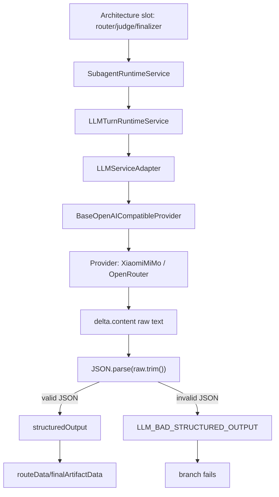
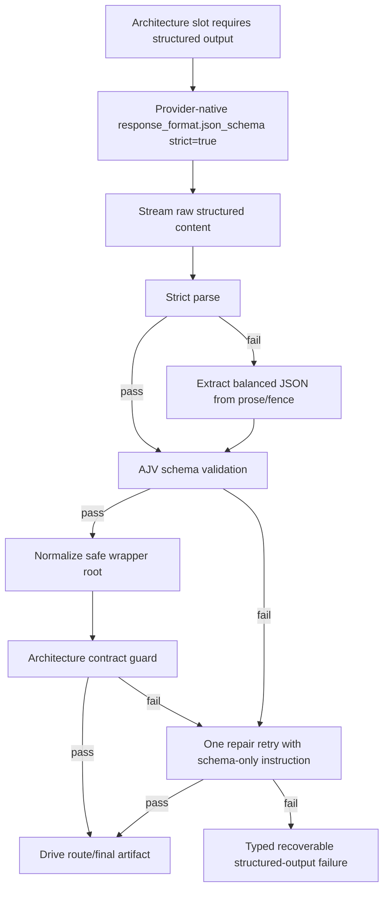
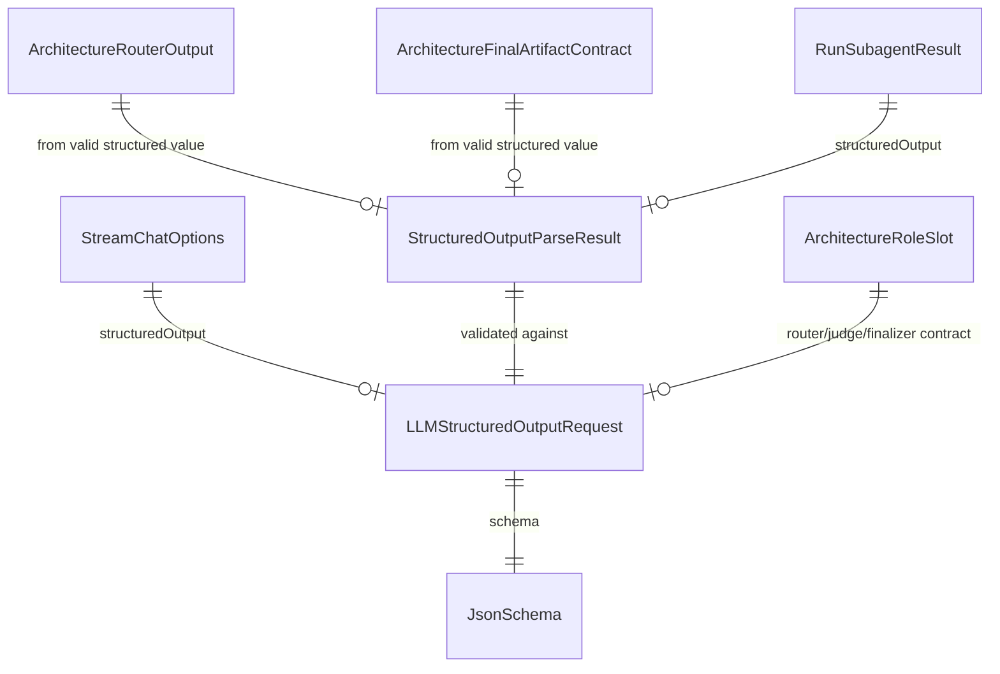

# Xiaomi Structured Output Recovery

## Context

Xiaomi MiMo `mimo-v2.5` returned prose where architecture router structured output required valid JSON. OpenRouter currently declares `response_format` and `structured_outputs` for `xiaomi/mimo-v2.5`, so the local fix keeps provider-native structured output mandatory and adds bounded recovery for malformed responses.

User decision: `Strict + retry`.

## Current Architecture

## Target Architecture

## Affected Models

## Checklist

- [x] Add failing provider tests for fenced/prose JSON, schema mismatch, known wrapper unwrapping, and OpenRouter `require_parameters`.
- [x] Add `ajv@8.20.0` to `kalio-api`.
- [x] Add provider parser with strict parse, balanced/fenced extraction, schema validation, and safe wrapper normalization.
- [x] Add OpenRouter provider preference `{ require_parameters: true }` when structured output is requested.
- [x] Add runtime repair retry for `LLM_BAD_STRUCTURED_OUTPUT` using a non-persisted repair message.
- [x] Add subagent fallback coverage for failed structured-output repair retry.
- [x] Tighten review findings: wrapper roots must be single-key, extracted JSON must be unambiguous, and repair retry drops partial first-attempt state.
- [x] Run focused provider/runtime/subagent/architecture tests together.
- [x] Run `corepack pnpm --filter kalio-api run typecheck`.
- [x] Resolve broader API blockers found by the first pass: durable architecture graph reconstruction and raw XML stream-processor allow-list coverage.
- [x] Run focused architecture/chat regression tests for the recovered blockers.
- [x] Run `kalio-api` lint after cleanup.
- [x] Run broader `kalio-api` test gate.

## Notes

- Malformed prose is never used directly to route the architecture graph.
- Extracted or unwrapped JSON is accepted only after it validates against the requested schema.
- Wrapper unwrapping is allowed only for exactly one known wrapper key with no sibling fields.
- Extracted prose/fence recovery rejects multiple schema-valid JSON candidates and triggers repair retry instead of choosing the first match.
- The repair retry is limited to one attempt and does not persist a synthetic user message.
- Focused verification passed: 74 tests across provider parser, OpenAI-compatible/OpenRouter provider behavior, runtime retry, subagent fallback, architecture structured output, and architecture LLM integration.
- Continuation verification resolved the broader API blockers:
  - `corepack pnpm --filter kalio-api exec vitest run src/modules/architecture/architecture.controller.spec.ts src/modules/architecture/architecture-durable-graph.spec.ts src/modules/architecture/architecture-graph-projection.spec.ts src/modules/chat/__tests__/stream-processor.spec.ts --reporter=verbose` -> 38 passed.
  - `corepack pnpm --filter kalio-api run lint` -> passed.
  - `corepack pnpm --filter kalio-api run typecheck` -> passed.
  - `corepack pnpm --filter kalio-api run test -- --reporter=dot` -> passed.
