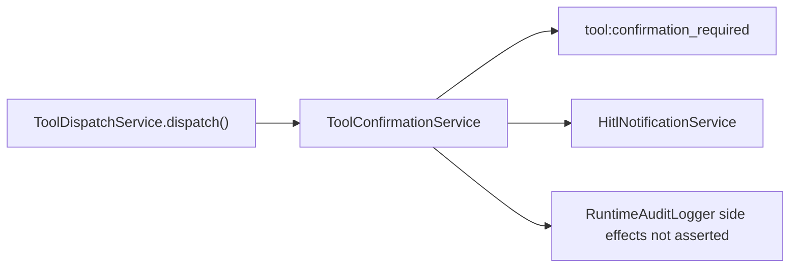
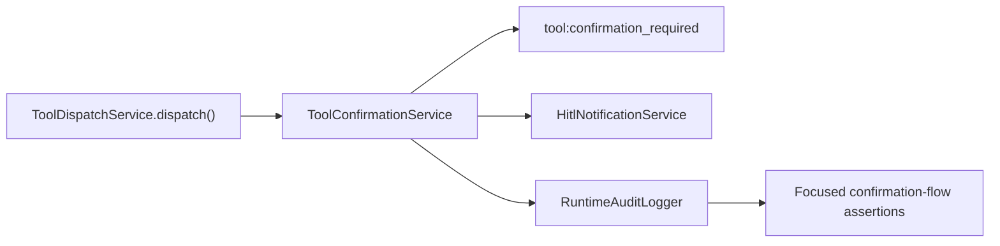
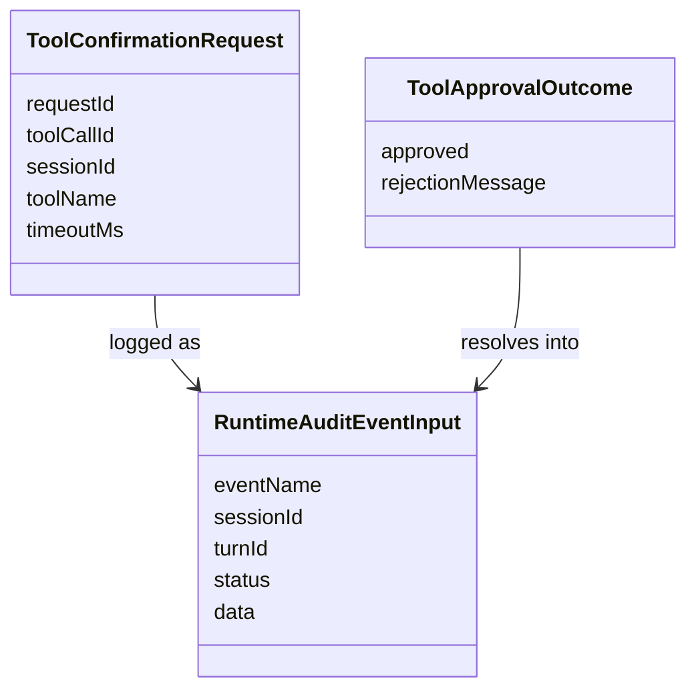

# Test Gap Detection: Tool Confirmation Runtime Audit

## Goal

Cover the untested runtime-audit side effects introduced in the tool confirmation flow without widening scope beyond the changed chat backend dispatch path.

## Acceptance Criteria

- Add focused assertions for `RuntimeAuditLogger` calls in the confirmation-required dispatch flow.
- Verify the requested and resolved confirmation events carry the typed runtime audit names and statuses.
- Run only the affected backend spec file.

## Current Architecture

## Target Architecture

## Affected Models

## Checklist

- [x] Review the changed confirmation flow and nearby spec coverage.
- [x] Add runtime-audit assertions for requested and approved confirmation events.
- [x] Run focused backend verification.
- [x] Record result and residual nearby gaps.

## Notes

- 2026-07-02: Current confirmation tests already prove HITL lifecycle notifications, but they do not assert the new `RuntimeAuditLogger` calls added in `ToolConfirmationService`.
- 2026-07-02: Scope stays inside `apps/kalio-api/src/modules/chat/__tests__/tool-dispatch.service.spec.ts`; no production change is planned unless the new assertions expose a regression.
- 2026-07-02: Added runtime-audit assertions for the requested/approved path in the existing confirmed-flow spec and a new focused denied-path spec with the user rejection message.
- 2026-07-02: Focused verification passed with `corepack pnpm --filter kalio-api exec vitest run src/modules/chat/__tests__/tool-dispatch.service.spec.ts --reporter=verbose` (33 tests).
- 2026-07-02: Residual nearby gap: timeout and abort runtime-audit payload shapes are still only indirectly covered through cancellation behavior, not asserted field-by-field.
