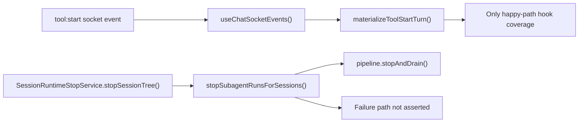
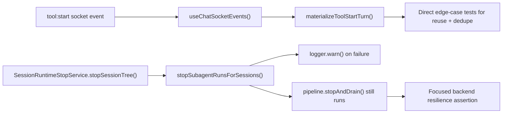
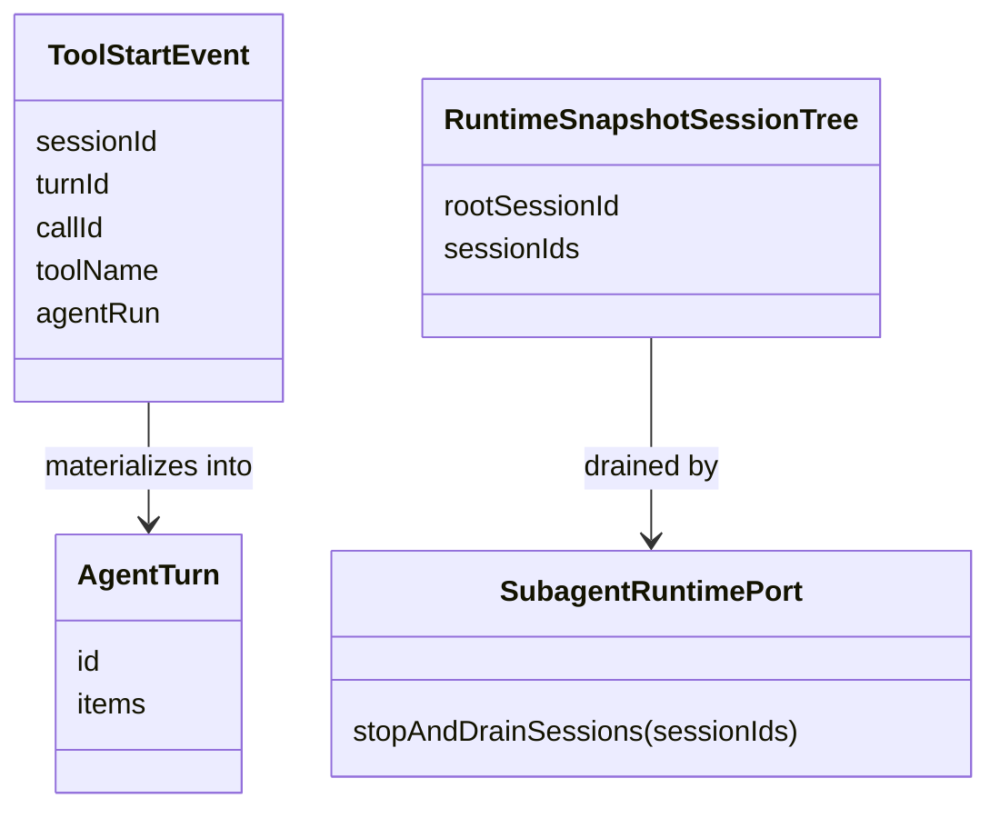

# Test Gap Detection: Subagent Runtime Edges

## Goal

Cover the smallest untested branches introduced by the latest subagent runtime changes without widening scope beyond the changed chat runtime files.

## Acceptance Criteria

- Add focused tests for the new frontend `tool:start` turn materialization edge handling.
- Add focused tests for the new backend subagent stop/drain failure path.
- Keep scope inside existing changed test files plus this note unless a test exposes a real regression.
- Run only the affected frontend and backend spec files.

## Current Architecture

## Target Architecture

## Affected Models

## Checklist

- [x] Review the changed subagent runtime branches and nearby test coverage.
- [x] Add frontend fallback assertions for `run_sub_agentflow` reload prompt binding.
- [x] Add backend failure-path assertions for `stopSubagentRunsForSessions()`.
- [x] Run focused verification for the touched specs.
- [x] Record result and residual nearby gaps.

## Notes

- 2026-07-04: The new frontend helper is only covered indirectly through one hook-level happy path; the reuse-current-turn and no-duplicate-item branches are still unasserted.
- 2026-07-04: The new backend subagent stop/drain integration only proves the successful ordering path; it does not yet prove that a thrown stop/drain error is logged and does not block chat pipeline draining.
- 2026-07-04: Added a frontend reload-hydration regression test for the `run_sub_agentflow` fallback branch that must bind the synthetic workflow envelope to the last user prompt before the tool call when `promptMessageId` is missing.
- 2026-07-04: Added a backend resilience test proving `stopSubagentRunsForSessions()` logs a warning and still drains the chat pipeline when the subagent stop call throws.
- 2026-07-04: No production code changes were needed; this run only added tests plus this note.
- 2026-07-04: Focused verification passed with `corepack pnpm --filter kalio-web exec vitest run src/features/chat/architectureReloadHydration.test.ts --reporter=verbose` and `corepack pnpm --filter kalio-api exec vitest run src/modules/chat/session-runtime-stop.service.spec.ts --reporter=verbose`.
- 2026-07-04: Residual nearby gaps remain in direct helper-level coverage for `materializeToolStartTurn()` dedup/reuse behavior and in alias-based subagent stop matching through `historySessionId` / `vfsSessionId`.
