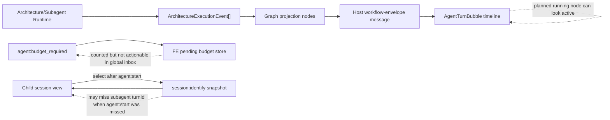
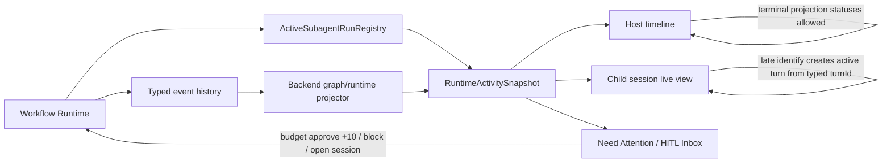
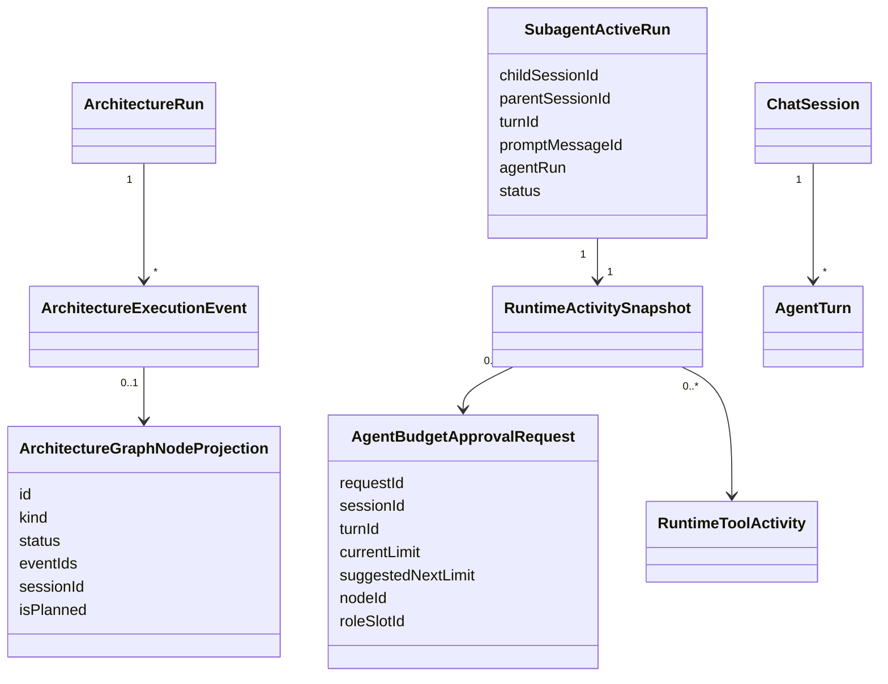

# Workflow Live Projection And Budget HITL Plan

## Summary

Naprawiamy trzy regresje runtime:

- Host chat bubble nie moze pokazywac przyszlego/finalizer node jako aktywnego, gdy realnie dziala wczesniejszy node.
- Wejscie w child/orchestrator session ma odtworzyc live runtime turn z typed snapshot/status, nie tylko pokazac historyczny snapshot.
- Limit tool calls ma tworzyc trwaly HITL budget request `+10`, widoczny w Need Attention i w child/root context.

Zasada: zadnych fixed waits jako naprawy architektury. Stan wynika z typed backend runtime, aktywnych runow, eventow i snapshotow.

## Current Architecture

## Target Architecture

## Model Relations

## Implementation Status

- [x] Add FE regression: planned/running finalizer without typed evidence is not rendered as active.
- [x] Add FE regression: planned/pending finalizer without typed evidence is not rendered in the host bubble.
- [x] Add FE regression: `plannedStatus: running` alone does not produce runtime `running`.
- [x] Add FE regression: late hydration can use newer typed `session:status` when runtime snapshot is stale/non-live.
- [x] Add FE regression: live session activation restores global streaming state from typed snapshot/status.
- [x] Add BE regression: active subagent run appears in runtime snapshot with `turnId`, `agentRun`, and pending budget approvals.
- [x] Add FE regression: pending budget request from runtime snapshot appears in Need Attention and approves `+10`.
- [x] Extend active subagent snapshot path to expose typed child run status.
- [x] Tighten timeline stages so artifact/finalizer cards require typed evidence unless terminal projection is explicit.
- [x] Render budget HITL in `HomeHitlInbox` with Open, +10, and Block actions.
- [x] Verify mock-provider workflow gates for budget HITL, malformed structured output failure, child live HITL, reconnect/hydration, sequential routing, and cross-browser replay.
- [x] Fix E2E stack runner so Codex bundled pnpm/corepack does not emit false non-TTY install errors during Playwright stack startup.
- [x] Document the Windows system-Node/outside-sandbox QA rule for pnpm junction `EPERM` and false `MODULE_NOT_FOUND` failures.
- [x] Fix workspace typecheck contract drift for `ArchitectureGraphProjection.nodes[].hasRuntimeEvidence`.
- [x] Fix Home HITL inbox crash when older/mocked stores do not expose `pendingBudgetApprovals`.
- [x] Run full local gates: `release:workflow-gate`, `typecheck`, `test`, and `build`.
- [x] Verify real Xiaomi MiMo normal chat stream on the FamilyQuest project.
- [x] Verify real Xiaomi MiMo FamilyQuest workflow completion and F5/reload rehydration.
- [ ] Verify with a real Xiaomi MiMo workflow/manual run where max tools triggers budget HITL.

## Acceptance Criteria

- Host chat never shows a future finalizer as pending/running unless backend graph projection has typed finalizer execution evidence or terminal status.
- Re-entering a running orchestrator/child session can materialize live turn and streaming state from typed runtime status.
- Max tool calls creates a durable budget HITL request with `suggestedNextLimit = currentLimit + 10`.
- Need Attention shows budget approvals before dismissible notices and can open/approve/block the owning session.
- F5/reconnect rebuilds all three states from backend snapshots without message-text inference.

## Notes

- 2026-07-04: User reported live regression on Lab Bug Hunter: host bubble shows finalizer running while orchestrator is still active; child orchestrator does not live-refresh; tool budget HITL is missing.
- 2026-07-04: Fixed waits are explicitly rejected as architecture fixes. Use typed state, active-run registry, durable snapshots, and explicit lifecycle events.
- 2026-07-04: Focused FE/API tests and typecheck passed after this slice; release gate/manual QA still pending.
- 2026-07-04: Reproduced RED tests for unevidenced pending finalizer and live activation missing `isStreaming`; both now pass after production fixes.
- 2026-07-04: `npm.cmd run release:workflow-gate` passed on the mock QA stack after the runner fix. This validates the local runtime contract but not live-provider behavior.
- 2026-07-04: E2E runner now prefers explicit system Corepack/Node when PATH contains Codex bundled runtimes, avoiding false `ERR_PNPM_ABORTED_REMOVE_MODULES_DIR_NO_TTY` noise.
- 2026-07-04: Sandbox Playwright stack runs can still hit pnpm junction access failures such as `EPERM` or false `MODULE_NOT_FOUND` for declared deps like `ajv`; valid Windows QA proof must use system Node outside the sandbox.
- 2026-07-04: Fresh `npm.cmd run release:workflow-gate` passed outside the sandbox with system Node. Managed stack was healthy on random ports and reported `effective provider=mock model=mock source=env`.
- 2026-07-04: Full `npm.cmd run typecheck` initially caught contract drift in `packages/@kalio/types/src/__tests__/contracts.test.ts`; fixed by adding optional `hasRuntimeEvidence?: boolean` to the asserted graph node shape, then typecheck passed.
- 2026-07-04: Full `npm.cmd run test` initially caught `HomeHitlInbox` crashing when `pendingBudgetApprovals` was absent in older/mocked stores; fixed by treating missing pending maps as empty objects. Targeted `LandingPage.test.tsx` and full test gate both pass.
- 2026-07-04: Full `npm.cmd run build` passed after the runtime/contract fixes. Vite still reports the existing large chunk warning.
- 2026-07-04: Activated local Xiaomi MiMo credential from ignored env into the managed QA DB, restarted the stack on the same data-root without env/mock forcing, and confirmed `effective provider=xiaomimimo model=mimo-v2.5 source=db`.
- 2026-07-04: Paid/live readiness passed before and after live Playwright proof: provider test, completion smoke, no stale AgentFlow runs, and no recent provider-failed Architecture projections.
- 2026-07-04: Real Xiaomi MiMo Playwright proof passed on the existing external stack: normal FamilyQuest chat streamed with the live model, and FamilyQuest Strategic Decision Council workflow completed and rehydrated after refresh.
- 2026-07-04: `npm.cmd run audit:report` completed and wrote `docs/audit/2026-07-04-report.md`; global audit still reports 25 red findings, requiring triage/waiver before calling the whole repo release-clean.
