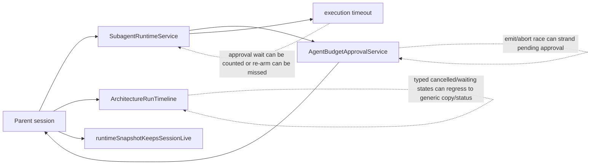
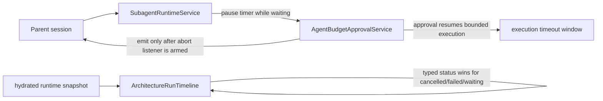
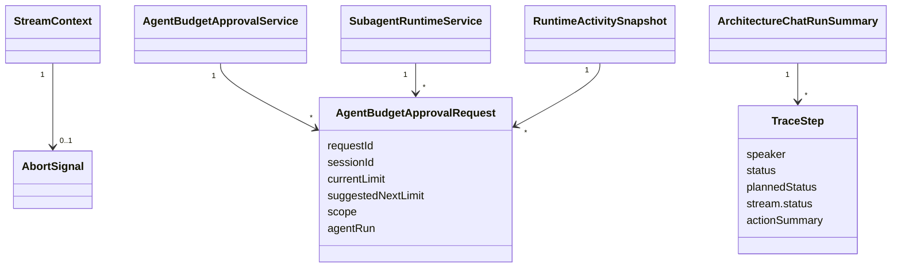

# Test Gap Detection: Live Projection And Budget Approval

## Summary

Ta runda jest ograniczona do biezacego diffu w obszarach:

- backendowego budget-HITL dla subagenta,
- timeoutu wykonania subagenta wokol oczekiwania na budzet,
- frontendowego timeline status/copy dla typed architecture trace,
- utrzymania live runtime snapshot przy pending budget approval.

Celem nie jest refaktor. Dokladamy tylko male regresje, ktore lapia realne sciezki wynikajace z ostatnich zmian.

## Current Architecture

## Target Architecture

## Model Relations

## Acceptance Criteria

- Abort wywolany synchronicznie podczas `agent:budget_required` nie zostawia osieroconego pending approval.
- Po zaakceptowaniu dodatkowego budzetu timeout subagenta nadal obowiazuje dla dalszego wykonania, ale czas oczekiwania na decyzje nie jest liczony.
- Timeline respektuje typed lifecycle statusy, zamiast przepinac sie na mylace completed copy.
- Weryfikacja uruchamia tylko testy dotknietych obszarow.

## Implementation Status

- [x] Potwierdzic najwyzsze luki testowe w backendowym diffie.
- [x] Dodac regresje backendowe dla race `emit -> abort` i re-arm timeout po approved budget.
- [x] Potwierdzic najwyzsze luki testowe we frontendowym diffie.
- [x] Dodac regresje frontendowe dla typed waiting/blocked/cancelled timeline semantics.
- [x] Uruchomic ukierunkowane testy dla zmienionych specow.
- [x] Ocenic, czy ten slice wymaga roboczego PR przez `$yeet`.

## Notes

- 2026-07-05: Zakres jest celowo waski i oparty tylko o pliki zmienione w biezacym worktree.
- 2026-07-05: Dodane backendowe regresje:
  - `agent-budget-approval.service.spec.ts`: sync `emit -> abort` invalidation oraz already-aborted signal bez `agent:budget_required`.
  - `subagent-runtime.service.spec.ts`: approved budget ponownie uzbraja timeout i kolejne wykonanie nadal moze sie poprawnie wysypac `SUBAGENT_TIMEOUT`.
- 2026-07-05: Dodane frontendowe regresje:
  - `ArchitectureRunTimeline.test.tsx`: typed `waiting_on_orchestrator`, `blocked`, `queued`, `done` oraz cancelled finalizer copy.
  - `useChatSocketEvents.helpers.test.ts`: hydrated runtime snapshot z `pendingBudgetApprovals` dalej materializuje live turn.
- 2026-07-05: Nowy frontend test ujawnil realny bug, nie tylko luke testowa: `statusForStep()` zwracal `completed` dla `waiting_on_orchestrator`, gdy krok mial prose `content`. Naprawa zostala ograniczona do `ArchitectureRunTimeline.stages.ts`, gdzie typed waiting/running/completed sa teraz respektowane przed fallbackiem do tresci.
- 2026-07-05: Weryfikacja przeszla lokalnie na targetowanych specach:
  - `apps/kalio-api/.\\node_modules\\.bin\\vitest.cmd run src/modules/chat/__tests__/agent-budget-approval.service.spec.ts src/modules/chat/__tests__/subagent-runtime.service.spec.ts`
  - `apps/kalio-web/.\\node_modules\\.bin\\vitest.cmd run src/features/chat/ArchitectureRunTimeline.test.tsx src/features/chat/hooks/useChatSocketEvents.helpers.test.ts`
- 2026-07-05: Roboczego PR nie otwieralem. Slice jest maly, lokalnie zweryfikowany i trafia w juz-edytowany worktree; decyzje o commit/PR lepiej podjac razem z reszta tego runtime slice.
