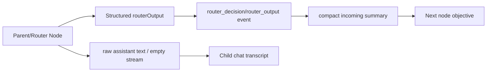
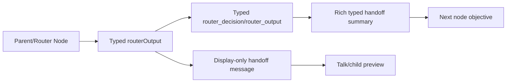
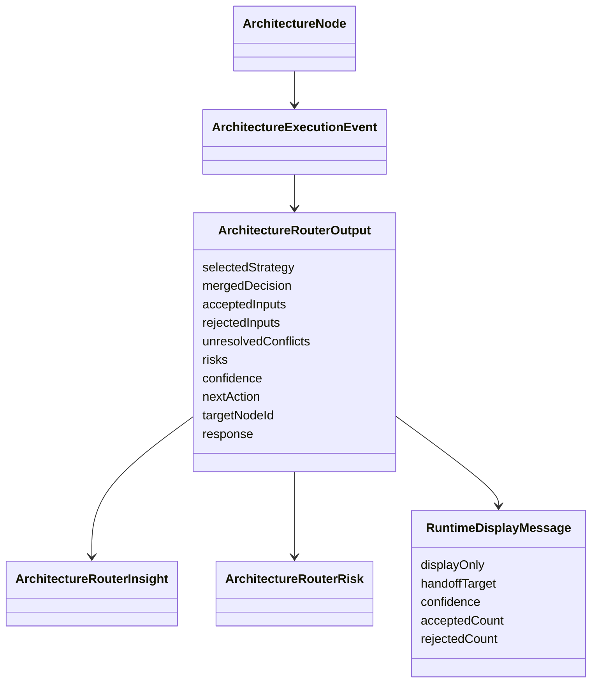

# Workflow Node Context Handoff

## Goal

Workflow nodes must receive typed, useful parent/router context and users must see explicit handoff output when a router/orchestrator finishes. Runtime routing stays driven by `routerOutput` structured output, not by assistant prose or a synthetic route tool.

## Current Architecture

Problem: `routerOutput` had rich accepted/rejected/risk/response fields, but downstream summaries kept mostly the merged decision. Router child chats could finish with no visible assistant handoff if the provider returned structured output without narrative text.

## Target Architecture

## Models

## Implementation Checklist

- [x] Enrich `summarizeArchitectureIncomingEvent()` so downstream finalizers/nodes receive accepted inputs, rejected inputs, conflicts, risks, target node, and router handoff response.
- [x] Generate a display-only router handoff message from typed structured output for router/judge nodes.
- [x] Keep control-flow in `routeData()` and structured `routerOutput`; no text parsing and no route tool fallback.
- [x] Add unit tests for rich incoming summaries.
- [x] Add unit tests for router handoff message generation.
- [x] Add executor regression proving structured route output produces visible handoff text and typed `route_to`.
- [x] Make active child-session selection force `session:identify` replay so late HITL/runtime snapshots are rehydrated.
- [x] Add FE regression proving forced active-session replay does not disable normal watch deduplication.
- [x] Render pending budget HITL even when a hydrated local turn is marked done; backend pending approval is authoritative.
- [x] Preserve `requestId` in architecture branch `human_gate` events so durable budget approval events are actionable.
- [x] Re-run focused FE/BE tests after the HITL visibility patch.
- [x] Re-run root typecheck/build after the HITL visibility patch.
- [x] Re-run a real workflow/manual QA pass on the managed stack after rebuilding this latest FE change.
- [x] Add typed downstream handoff packets beside compact incoming summaries so child nodes receive target/action/response/evidence context from parent/router nodes.
- [x] Add shared frontend budget HITL projector from typed architecture `human_gate` events.
- [x] Sync budget HITL projection from architecture run reload/polling paths, not only first child-session activation.
- [x] Clear local budget HITL after any typed user decision (`block`, `+1`, `+10`, `unlimited`) while keeping backend invalidation idempotent.
- [x] Fix remaining live blocker: `turn-budget-approval` renders from durable events and the `+10` resume path passes in live Playwright.
- [x] Add root `project-spec.md` as the durable cross-session product/runtime boundary spec and point `AGENTS.md` to it.
- [x] Fix router display handoff so structured `mergedDecision` and `response` are both visible while control flow stays typed.
- [x] Remove exact fixed-duration assertion from `wait-for` timeout coverage; tests assert timeout contract, not a specific millisecond value.
- [x] Fix AC-13 E2E to assert durable queued-message acceptance instead of transient `chat-queued-badge` visibility.
- [x] Fix HITL tool confirmation E2E polling to tolerate retryable API transport resets while preserving runtime/VFS assertions.
- [x] Run full root `npm test`, root `typecheck`, and root `build` after final fixes.
- [x] Run `release:workflow-gate` and full `test:e2e` after final fixes.
- [x] Add router pause regression: `ask_human` with `targetNodeId` is not a route call and emits no downstream `selectedNodeIds`.
- [x] Re-run the previously failing live sequential router-chain on Xiaomi MiMo after the pause-route fix.
- [x] Fix live budget HITL E2E to use exposed `vfs_list` instead of hidden host `fs_list`, then re-run it on Xiaomi MiMo.

## Notes

- A dedicated `route` tool is not needed for this slice. The correct contract is provider-native structured output plus typed runtime events.
- The visible handoff text is display-only; changing its wording must not affect routing.
- Live Xiaomi QA exposed a separate activation issue: a child session can be pre-identified before a budget HITL exists, so later active selection must force replay rather than skip `session:identify`.
- 2026-07-05 live QA after rebuild on `xiaomimimo/mimo-v2.5`: backend durable event history is correct, frontend materializes typed `human_gate` budget approvals from `/api/architecture-runs/:runId/events`, and `+10` clears the visible pending HITL before resuming. A backend-owned `RuntimeActivitySnapshot.pendingBudgetApprovals` projection is still the cleaner long-term source, but no longer blocks this slice.
- 2026-07-05 root gate after final fixes: `npm.cmd run test`, `npm.cmd run typecheck`, `npm.cmd run build`, `npm.cmd run audit:report`, `npm.cmd run release:workflow-gate`, and full `npm.cmd run test:e2e` pass. The remaining exact `5ms` wait assertion was removed because fixed-duration equality is not an architecture contract.
- 2026-07-05 broad E2E fix: AC-13 now waits on durable queued user bubbles; HITL VFS polling treats `ECONNRESET` as retryable transport while still failing real non-retryable errors. No architecture fix relies on sleeping.
- 2026-07-06 live sequential router-chain regression: Xiaomi MiMo exposed that `ask_human` with a `targetNodeId` was projected as a normal downstream route before the later `human_gate`. Runtime now clears selected nodes for pause routes before emitting router events, so graph projection cannot show a fake pending/finalizer route.
- 2026-07-06 live budget HITL regression: the previous live test used unavailable host `fs_list` in a VFS-only branch. The runtime correctly completed with no budget request because the model refused the hidden tool. The test now uses exposed `vfs_list` to verify the real budget HITL contract.
