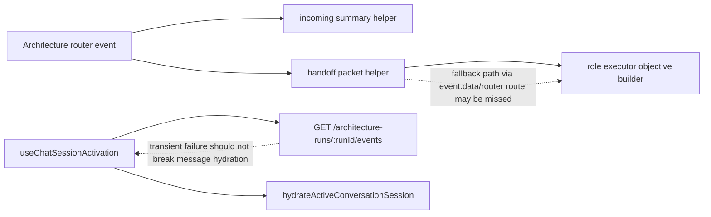
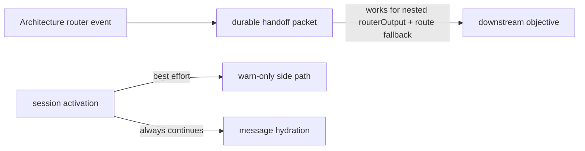
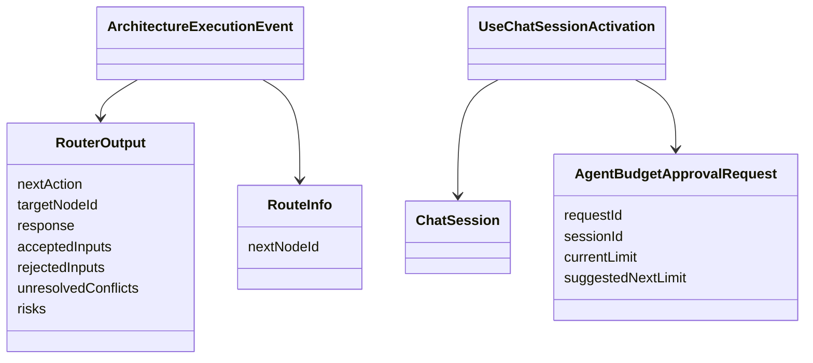

# Test Gap Detection: Router Handoff And Activation Hydration

## Summary

Ta runda jest ograniczona do dwoch nowych sciezek z biezacego dirty diffu:

- backendowego handoff packet dla `routerOutput`, ktory zasila downstream objective,
- frontendowej aktywacji sesji dziecka, ktora doklada fetch durable budget approvals obok zwyklego hydrate historii.

Bez refaktoru i bez zmian produkcyjnych, chyba ze nowy test ujawni realny bug.

## Current Architecture

## Target Architecture

## Model Relations

## Acceptance Criteria

- `summarizeArchitectureIncomingHandoffPacket()` ma bezposrednia regresje dla fallbacku `data.routerOutput` oraz `route.nextNodeId`.
- `useChatSessionActivation()` ma regresje, ze blad fetchu architecture events tylko loguje warning i nie blokuje zwyklego fetchu historii.
- Uruchamiam tylko dotkniete specy.

## Implementation Status

- [x] Wyizolowac najistotniejsze nieprzetestowane sciezki po runie z 2026-07-05.
- [x] Dodac backendowy test fallbacku handoff packet.
- [x] Dodac frontendowy test fallbacku top-level node metadata dla architecture budget reload.
- [x] Uruchomic targetowane Vitesty.
- [ ] Zapisac wynik i pozostale ryzyka w memory automacji.

## Notes

- 2026-07-06: Wczorajszy slice zamknal budget timeline/runtime projection; dzisiejszy scope dotyczy tylko nowych zmian po tamtym przebiegu.
- 2026-07-06: Dodany backendowy test w `apps/kalio-api/src/modules/architecture/architecture-incoming-event-summary.spec.ts` przypina fallback `data.routerOutput` + `route.nextNodeId` dla downstream handoff packet.
- 2026-07-06: Dodany frontendowy test w `apps/kalio-web/src/features/chat/architectureReloadHydration.test.ts` przypina fallback `event.nodeId` / `event.roleSlotId`, gdy payload budget HITL nie niesie tych pol.
- 2026-07-06: Probe z `useChatSessionActivation` na izolowany warning path okazal sie zlym zalozeniem, bo ten sam `architectureRunId` uruchamia tez reload projekcji w hydrate historii. Test nie zostal zachowany; zamiast tego scope zostal zawężony do bezposredniego helpera reload projection.
- 2026-07-06: Weryfikacja przeszla:
  - `apps/kalio-api/.\\node_modules\\.bin\\vitest.cmd run src/modules/architecture/architecture-incoming-event-summary.spec.ts --reporter=verbose`
  - `apps/kalio-web/.\\node_modules\\.bin\\vitest.cmd run src/features/chat/hooks/useChatSessionActivation.test.ts src/features/chat/architectureReloadHydration.test.ts --reporter=verbose`
- 2026-07-06: `useChatSessionActivation.test.ts` nadal emituje stderr z istniejacego mock gap w reload hydration dla child-session projection (`buildSyntheticArchitectureChildMessage` na niepelnej projekcji), ale targetowane asercje przechodza; to pozostaje osobnym lokalnym ryzykiem test harnessu.
