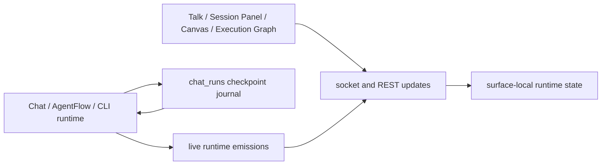
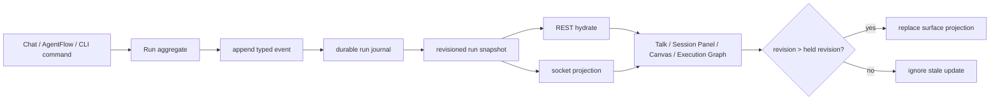
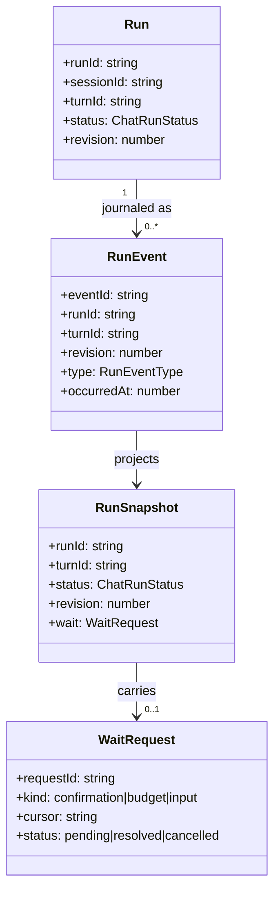

# AAA Runtime Status Convergence

## Goal

Converge AAA runtime execution on one durable, revisioned run contract. Backend journal history is authoritative; all frontend surfaces consume the same revisioned projection and never infer lifecycle from transcript text or socket timing.

## Current Architecture



Current gaps: `ChatRunStatus` is being extended and the run journal preserves `waiting_for_human`, but queue state, durable wait request/cursor data, event commit ordering, and frontend stale-revision rejection are not yet one end-to-end contract.

## Target Architecture



Invariant: commit the event before deriving a snapshot or emitting it. A failed commit produces no visible state transition. Each run revision is monotonic; every FE surface accepts only a strictly greater revision for the same `runId`.

## Runtime Model



Canonical lifecycle statuses:

| Status | Meaning | Terminal |
| --- | --- | --- |
| `queued` | Accepted but not executing. | No |
| `running` | Executing LLM, workflow, CLI, or tool work. | No |
| `waiting_for_human` | Durable approval, budget, or input wait exists. | No |
| `completed` | The run finished successfully. | Yes |
| `failed` | The run ended with a typed error. | Yes |
| `blocked` | The run cannot continue without an external prerequisite. | Yes |
| `cancelled` | A user or system stop ended the run. | Yes |

Terminal events must include the originating `runId` and `turnId`. A terminal event cannot finish, clear a wait for, or replace the projection of another turn.

## Restart-Safe HITL Extension

```mermaid
sequenceDiagram
  participant Loop as Agent loop
  participant Journal as Run journal
  participant HITL as HITL request store
  participant User as Human
  participant Resume as Continuation executor

  Loop->>Journal: checkpoint waiting_for_human
  Loop->>HITL: create cursor + pending request
  Note over Loop: process may stop here
  User->>HITL: CAS pending -> approved
  HITL->>Resume: approved cursor
  Resume->>Journal: CAS waiting -> tool_running
  Resume->>Resume: dispatch approved tool exactly once
  Resume->>Journal: persist tool result
  Resume->>Loop: resume same turn and budget
```

The durable cursor contains only typed execution data: `runId`, `sessionId`, `turnId`, `promptMessageId`, assistant tool-call message id, tool-call ordinal/remaining ids, iteration/budget state, runtime kind, and explicit execution state. It never reconstructs control flow from transcript text. A crash after a destructive tool has been claimed but before its durable result is a blocker requiring explicit resolution; it must never replay the tool automatically.

## Implementation Checklist

- [x] Extend `ChatRunStatus` toward the shared runtime lifecycle contract.
- [x] Preserve a `waiting_for_human` run as current through `RunJournalService` stale-active recovery.
- [x] Persist and replay well-formed tool-confirmation requests through the same socket and runtime-snapshot projection after F5/reconnect.
- [x] Prove a child session restores its pending HITL after F5 and completes the same approved tool action.
- [x] Persist queue acceptance and dequeue transitions in the durable journal before projection/emission.
  - Acceptance precedes `chat:queued`; exact-run CAS dequeue preserves `runId`, `turnId`, and `clientMessageId`.
  - `session:identify` bootstraps durable queued rows after restart without sleeps.
- [x] Persist each HITL continuation cursor so an approved request can resume the exact pending decision after process restart.
- [x] Add a CAS-backed continuation executor that claims an approved request, persists the exact tool result, then resumes the same turn/budget.
- [x] Persist a typed `runtime_pause` graph continuation when a child requests tool confirmation or additional budget.
- [x] Add revision/lease CAS primitives so only one backend instance can claim an orphaned AgentFlow run.
- [x] Persist stable child wait identity (`requestId`, child session/turn, prompt message) in the graph continuation.
- [x] Persist terminal child text and structured output in the chat-run journal and consume it without a second LLM turn during node replay.
- [x] Claim and automatically resume the parent after child completion using event-driven journal notification plus a bootstrap recovery scan.
- [x] Prove no duplicate child/tool/root execution under a physical Nest restart E2E for the observed restart-before-approval path.
- [x] Prove and harden exactly-once continuation for a crash after parent `tool_result` persistence but before the resumed parent LLM completes.
- [x] Commit tool-result events before `tool:*`, terminal, or derived snapshot emission.
- [x] Add backend-owned monotonic `chat_runs.revision` with a forward-only migration and bootstrap compatibility repair.
- [x] Add a shared FE per-run revision gate; reject equal and lower revisions before Talk, Session Panel, Canvas, or Execution Graph can project them.
- [x] Make terminal event reducers turn-scoped and prove an old turn cannot overwrite a newer turn.
- [x] Remove composer time-window throttling; accept distinct queued sends through the message queue contract and prove rapid Enter sends create every user bubble.
- [x] Make the isolated E2E embedding provider explicit and deterministic; a memory ingestion `500` fails the test rather than becoming a skip.
- [x] Replace legacy lifecycle vocabulary at runtime boundaries or map it explicitly to the canonical statuses without silent success fallback.
  - Unknown subagent, architecture trace, and persisted CLI lifecycle values remain unresolved instead of projecting success.
- [x] Add terminal cross-surface hydration proof after reload for Talk, Session Panel, Canvas, and Execution Graph.
- [x] Add active child HITL cross-surface proof before and after physical backend restart.
- [x] Run Comet live QA only after all mock/durable checks pass; do not record credentials, tokens, endpoints, or prompt contents. Readiness and completion smoke passed; FE chat and council later terminated with typed provider failures after repeated Comet `503` no-available-channel responses.

## Test Matrix

| Contract | Focused proof | Required assertion |
| --- | --- | --- |
| Durable journal | `RunJournalService` unit/integration test | Start, checkpoint, restart recovery, and terminal snapshot remain durable. |
| HITL replay projection | Gateway and `HitlRequestService` tests | A persisted request appears once in both the socket replay and the backend snapshot after reconnect. |
| Child HITL restart | `subconversation-live-hitl.spec.ts` | A child survives a physical backend restart, renders the durable approval again, and completes only after that approval. |
| Parent workflow continuation | Physical Nest restart integration/E2E | Approving the durable child wait resumes the same parent node once, without a duplicate child session, tool call, or root-node replay. |
| Persistent HITL | Journal plus REST hydration test | `waiting_for_human` restores the same request id, kind, and cursor after reconnect/F5. |
| Stale revisions | FE projection reducer tests | Equal/lower revision is ignored; greater revision replaces state. |
| Turn-scoped terminal events | Backend and FE reducer tests | A terminal event only affects its matching `runId` and `turnId`. |
| Rapid queue sends | `ChatInput` unit test and AC-13 Playwright | Distinct messages sent without elapsed-time gating are each accepted and displayed. |
| E2E embedding profile | Memory integration and credential Playwright tests | The mock fallback is explicit, active DB credentials take precedence, and ingestion failures fail the suite. |
| Cross-surface E2E | Playwright started from Kalio FE | Talk, Session Panel, Canvas, and Execution Graph agree before and after reload. |
| Comet live QA | Managed QA stack + Playwright | Effective provider is verified, lifecycle proof is observed from FE, and no credential is logged. |

## Notes

- This slice now includes the durable HITL implementation and physical backend-restart E2E coverage.
- `RunJournalService` coverage proves that a persistent human wait is not converted to restart recovery state.
- The Playwright launcher exposes a loopback-only, per-run tokenized restart control plane; responses return only after backend health recovery on the same isolated database and workspace.
- Production `ChatGateway` DI is covered explicitly so durable replay/continuation services cannot silently become `undefined` through erased `Pick<>` metadata.
- Terminal cross-surface parity is covered by the Architecture Debate reload scenario, including the host `session-done` projection. Active child HITL parity is covered before and after physical backend restart; pending confirmation is authoritative over stale child success in Canvas and Execution Graph.
- Physical restart proof now passes for nested HITL: approval resumes the owning parent once, reconstructs graph branches from typed session metadata, and advances the graph without root replay.
- Terminal AgentFlow projection now drops stale `runtime_pause` cursors, and completed chat runs clear stale restart errors.
- Parent recovery is event-driven after a terminal child journal outcome; it does not poll or sleep. A durable revision CAS claim prevents concurrent continuation, bootstrap recovery discovers missed child completions, and an already persisted parent `tool_result` is reused after restart.
- Live QA is a final evidence layer, not a substitute for deterministic journal, projection, and E2E tests.
- The deterministic release gate is green. Live Comet FE success remains an external availability risk: current failures are explicit terminal provider errors, not stale or hanging Kalio workflow states.
- 2026-07-11 final live follow-up: a real DeepSeek chat and `Lab: Solo + Walidator` workflow completed through FE. Failed prior turns are excluded from later provider context by durable status. Comet's incompatible `tools + response_format` combination is prevented by provider capability, and paid readiness verifies the tested persona model when requested.
