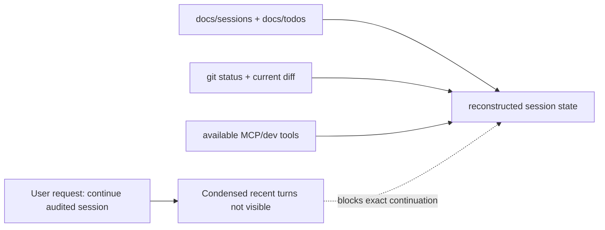
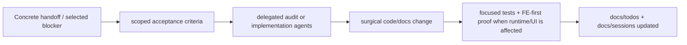
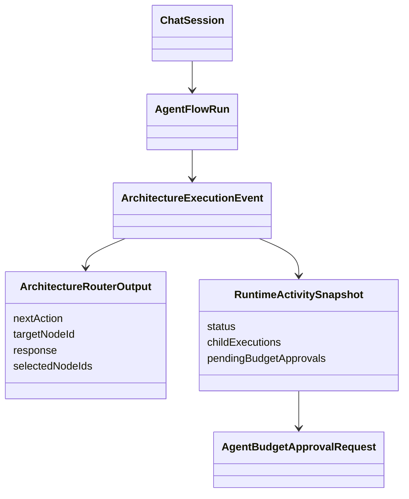

# Audited CLI Session Resume

## Goal

Resume the audited workflow/CLI-agent session without fabricating hidden context. The immediate objective is to reconstruct verified state from durable repo evidence, identify the next release-safe action, and avoid code changes until the concrete continuation target is known.

## Current Architecture

## Target Architecture

## Models And Relations

## Reconstructed State

- Worktree has this untracked resume note while the code tree has no detected edits.
- No active managed dev-server sessions are running.
- Latest durable session note is `docs/sessions/2026-07-05-workflow-node-context-handoff.md`.
- Latest completed slice verified router handoff display, typed downstream handoff packets, child-session activation replay, durable budget HITL projection, Xiaomi MiMo live budget HITL, sequential router-chain, full root tests, typecheck, build, audit report, workflow gate, and full E2E.
- Latest audit report still shows 25 CRITICAL file-size/god-object findings and 0 HIGH string-business-logic findings.
- Serena tools and Serena memory are not available in this Codex tool surface, so the unchecked automation-memory item in `docs/todos/2026-07-06-test-gap-detection-router-handoff-activation.md` cannot be completed honestly here.

## Acceptance Criteria

- [x] Read project instructions and latest durable session/todo notes.
- [x] Confirm git state before modifying anything.
- [x] Check available dev-server/MCP state.
- [x] Use native web search for current external baseline before choosing workflow direction.
- [x] Record a resume plan with current/target/model Mermaid diagrams.
- [x] Receive or locate the missing condensed recent turns / exact continuation target.
- [x] Once target is known, use subagents for disjoint audit/implementation review where practical.
- [x] Verify direct `run_cli_agent` persists typed CLI runtime metadata like spawned CLI sessions.
- [x] Run the strongest focused verification for the selected slice.
- [x] End with a structured status report including verification gaps.

## Notes

- 2026-07-10: The visible prompt says to use condensed recent turns, but those turns are not present in the accessible conversation context. I reconstructed from durable repo notes instead.
- 2026-07-10: Do not start a broad refactor from the 25 CRITICAL audit rows without explicit target selection; several listed files are load-bearing runtime surfaces and over the repo file-size limit.
- 2026-07-10: Next best action is to provide the missing condensed handoff or select one concrete blocker, such as final manual FE-first release smoke, audit red triage, or a specific runtime verification gap.
- 2026-07-10: Subagent inspection selected a bounded audited CLI-agent gap: direct `run_cli_agent` creates a durable CLI child session but did not appear to call the typed metadata persistence path used by `spawn_cli_agent`.
- 2026-07-10: RED/GREEN fixed the direct `run_cli_agent` metadata gap by persisting `{ agentId, workdir }` into typed session runtime context immediately after child session creation. Verification passed: direct tool spec 30/30, CLI metadata/runtime specs 19/19, `kalio-api` typecheck, `kalio-api` build, and `git diff --check` with only existing Windows LF/CRLF warnings.
