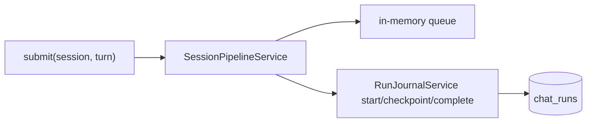
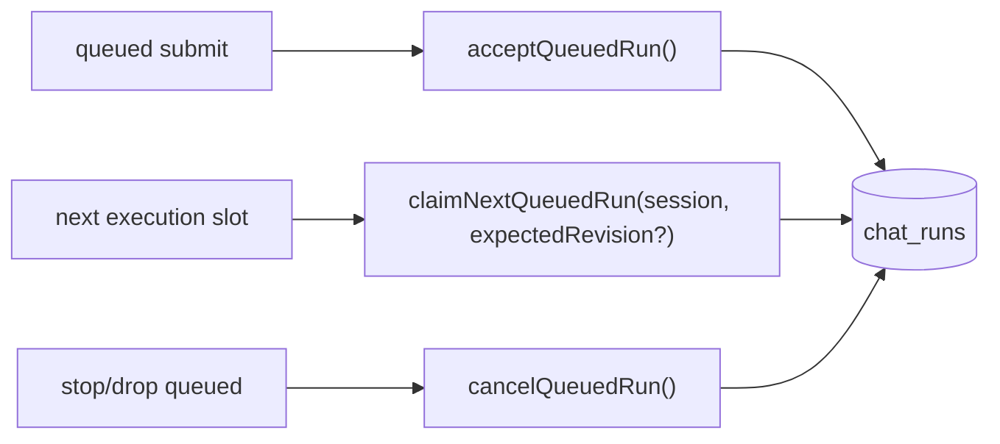
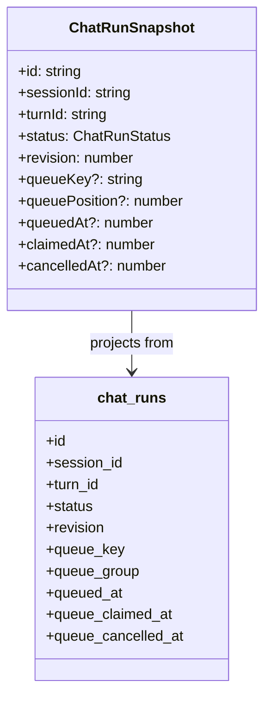

# Durable Queued Chat Run Journal

## Goal

Implement only the durable queued chat run journal contract:

- schema and migration for queued run payload storage
- shared `ChatRunStatus` and queued payload fields
- `RunJournalService` queue methods with idempotency and FIFO/CAS
- physical SQLite unit tests

Out of scope for this slice:

- `SessionPipelineService`
- gateway emission/projection changes
- FE consumption changes

## Acceptance Criteria

- [x] `chat_runs` persists queued payload fields needed for durable queue acceptance/claim/cancel.
- [x] Shared `ChatRunSnapshot` exposes queued contract fields with explicit typing.
- [x] `RunJournalService.acceptQueuedRun()` is idempotent for the same queued item identity.
- [x] `RunJournalService.claimNextQueuedRun()` claims exactly one queued run for a session in FIFO order.
- [x] Claim uses revision/CAS so a queued run cannot be claimed twice.
- [x] `RunJournalService.listQueuedRuns()` returns queued items in durable FIFO order.
- [x] `RunJournalService.cancelQueuedRun()` only cancels durable queued work and is idempotent.
- [x] Physical SQLite tests prove the above against a real table definition.

## Current Architecture

Issue: the durable journal knows active/history state, but queued acceptance metadata and FIFO claim/cancel mechanics are not stored as a first-class contract.

## Target Architecture

Invariant: durable queue order comes from persisted acceptance order, and only one claimant can transition a queued row into active execution.

## Model Changes

## Notes

- Queue status stays durable in `chat_runs`; this slice does not wire new methods into pipeline/gateway yet.
- If the existing dirty worktree changes these files concurrently, re-read before finalizing the patch.
- Focused verification passed on 2026-07-11:
  - `packages/@kalio/types`: contract test and build
  - `apps/kalio-api`: `run-journal.service.spec.ts`, `drizzle.service.spec.ts`, and `tsc --noEmit`
