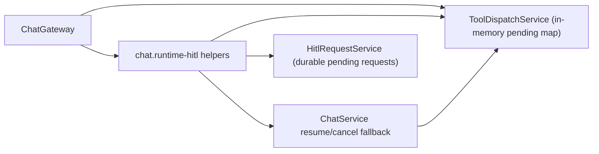
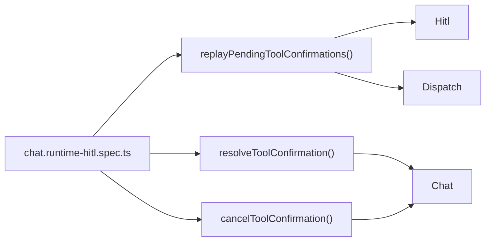
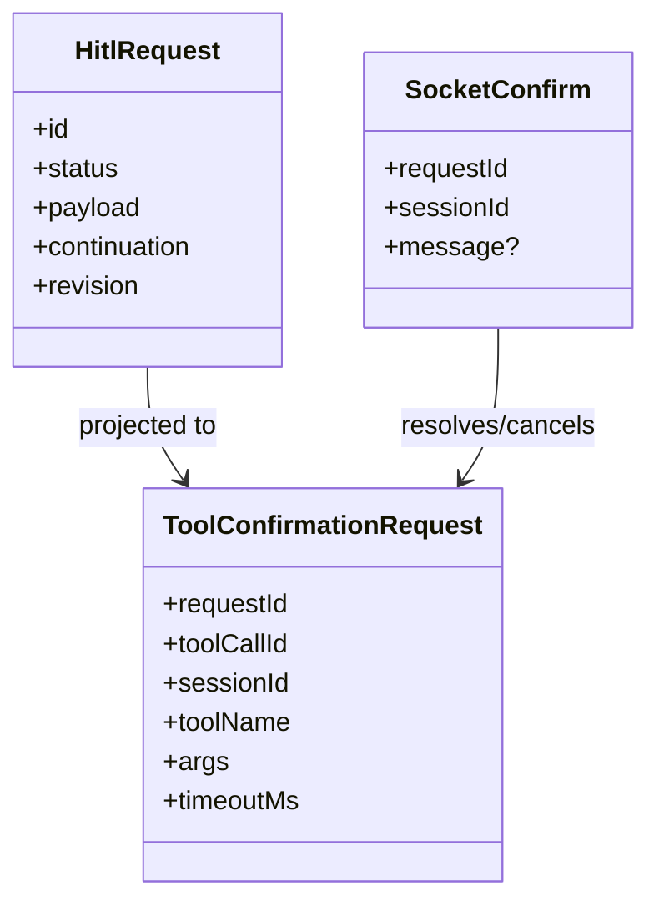

# Test Gap Detection: runtime HITL fallback

## Acceptance criteria

- [ ] Confirm a concrete untested path in the latest dirty diff.
- [ ] Add minimal tests only in the touched runtime-HITL area.
- [ ] Verify the focused spec passes with system Node + Vitest.

## Why this slice

Recent changes moved tool confirmation replay/confirm/cancel logic into
`apps/kalio-api/src/modules/chat/chat.runtime-hitl.ts` and added durable
fallbacks through `HitlRequestService` and `ChatService`. The file currently has
only a merge test, so the behavior that matters most after restart or runtime
eviction still lacks direct proof.

## Current architecture

## Target verification architecture

## Affected model relations

## Plan

- [ ] Add replay test proving durable-only requests are emitted once and deduped against already replayed ids.
- [ ] Add confirm fallback test proving `approveAndResumeTool()` handles a `not_found` runtime confirmation without invalidation noise.
- [ ] Add cancel fallback test proving durable cancel emits `reason: cancelled` instead of generic `not_found`.

## Notes

- Scope intentionally excludes broader runtime/chat service tests because those areas already changed heavily in this worktree.
