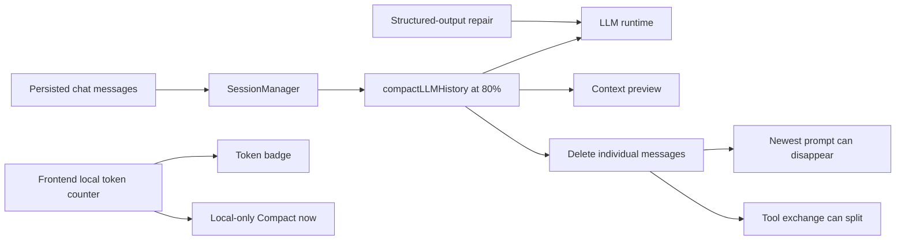
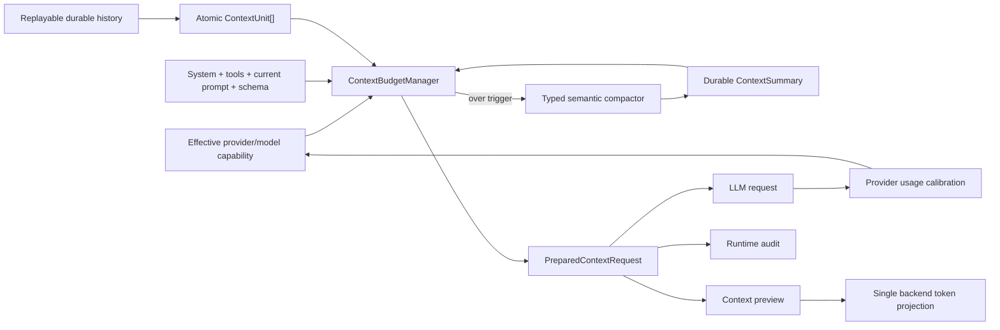
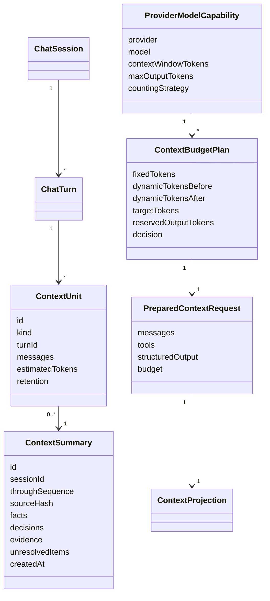

# AAA Context Compaction Standardization Implementation Plan

> **For agentic workers:** REQUIRED SUB-SKILL: Use `superpowers:subagent-driven-development` or `superpowers:executing-plans`. Track every step with the checkboxes below and preserve test-first order.

**Goal:** Replace lossy, heuristic chat-history trimming with one backend-owned, provider-aware context budget and compaction contract used identically by chat, workflow branches, retries, preview, audit, and frontend projections.

**Architecture:** Introduce a pure `ContextBudgetManager` that budgets the exact provider request in atomic conversation units. Protect instructions, current user intent, open tool exchanges, and output reserve; compact closed history through durable semantic summaries to a 25% retention target. Runtime, preview, structured-output repair, and manual compaction must consume the same prepared-request projection.

**Tech stack:** TypeScript 5.8, NestJS 11, React 19, Vitest, Playwright, SQLite/Drizzle, OpenAI-compatible providers including CometAPI.

## Global Constraints

- Backend durable state is the source of truth. FE cannot independently compact or infer request size.
- No routing, retention, or compaction decision may depend on message text matching.
- Preserve the newest user prompt and every open tool exchange unconditionally.
- Treat one assistant message and all tool results referenced by its `toolCalls` as one atomic exchange.
- Dynamic closed history triggers compaction above 50% of the model context and targets at most 25%.
- System instructions, tool definitions, current prompt, active tool exchange, structured-output schema, and output reserve are outside the 25% history target but inside the hard model window.
- The hard invariant is `estimatedInput + reservedOutput <= effectiveContextWindow`.
- Fixed-duration waits are forbidden as correctness mechanisms.
- Files approaching 500 LOC must be split before adding behavior.

## Current Architecture



## Target Architecture



## Models And Relations



## Runtime Contract

```ts
type ContextUnitKind =
  | 'system_instructions'
  | 'tool_definitions'
  | 'closed_turn'
  | 'tool_exchange'
  | 'durable_summary'
  | 'current_user_prompt'
  | 'structured_output_schema';

type ContextRetention = 'required' | 'summarizable' | 'droppable';

interface ProviderModelCapability {
  provider: string;
  model: string;
  contextWindowTokens: number;
  maxOutputTokens: number;
  countingStrategy: 'provider_api' | 'tokenizer' | 'calibrated_estimate';
}

interface ContextBudgetPlan {
  contextWindowTokens: number;
  reservedOutputTokens: number;
  hardInputLimit: number;
  compactionTriggerTokens: number;
  dynamicHistoryTargetTokens: number;
  fixedTokens: number;
  dynamicTokensBefore: number;
  dynamicTokensAfter: number;
  decision: 'unchanged' | 'summarized' | 'rejected';
  reasonCode?: 'FIXED_CONTEXT_EXCEEDS_WINDOW' | 'COMPACTION_TARGET_UNREACHABLE';
}

interface PreparedContextRequest {
  messages: ContextManagedLLMMessage[];
  tools: LLMToolDef[];
  structuredOutput?: StructuredOutputRequest;
  budget: ContextBudgetPlan;
}
```

## Task 1: Lock Critical History Invariants

**Files:**
- Modify: `apps/kalio-api/src/modules/chat/llm-history.utils.ts`
- Modify: `apps/kalio-api/src/modules/chat/llm-history.utils.spec.ts`

- [ ] Add a failing test proving the newest user prompt remains after compaction when older user and assistant turns exceed the budget.
- [ ] Add a failing test with one assistant message containing two tool calls and two results; assert the entire four-message exchange is retained or removed atomically.
- [ ] Add a failing test proving the final token estimate is at or below target, or returns a typed rejection when required content alone exceeds it.
- [ ] Replace `findOldestToolPair` with atomic exchange grouping by `toolCallId[]` and turn identity.
- [ ] Replace “truncate once and break” with a terminating budget loop and explicit unreachable-target result.
- [ ] Run `corepack pnpm --filter kalio-api test -- src/modules/chat/llm-history.utils.spec.ts` and require all tests to pass.

## Task 2: Introduce Provider-Aware Capability Resolution

**Files:**
- Create: `apps/kalio-api/src/modules/llm/provider-model-capability.service.ts`
- Create: `apps/kalio-api/src/modules/llm/provider-model-capability.service.spec.ts`
- Modify: `apps/kalio-api/src/modules/credentials/credentials.service.ts`
- Modify: `apps/kalio-api/src/modules/llm/llm.types.ts`

- [ ] Add tests for active CometAPI/deepseek, explicit workflow model override, unknown model fallback, and output-token reservation.
- [ ] Resolve context and output limits from the effective provider/model pair, never from one global setting.
- [ ] Use provider metadata when available; otherwise require an explicit configured limit and mark the counting strategy `calibrated_estimate`.
- [ ] Reject impossible or unknown limits with a typed configuration error before starting the turn.
- [ ] Preserve existing wire compatibility for `context_window_size` as a temporary default with `TODO: legacy fallback`.

## Task 3: Build Atomic Context Units

**Files:**
- Create: `apps/kalio-api/src/modules/chat/context-units.ts`
- Create: `apps/kalio-api/src/modules/chat/context-units.spec.ts`

- [ ] Test grouping for system instructions, ordinary turns, multiple-tool exchanges, current prompt, reasoning, and structured-output schema.
- [ ] Implement `buildContextUnits(request): ContextUnit[]` without text parsing.
- [ ] Mark system, current prompt, open tool exchanges, and schema as `required`.
- [ ] Mark completed historical turns and completed tool exchanges as `summarizable`.
- [ ] Assert every tool result belongs to exactly one assistant tool call or fail with `CONTRACT_VIOLATION`.

## Task 4: Create The Context Budget Manager

**Files:**
- Create: `apps/kalio-api/src/modules/chat/context-budget-manager.service.ts`
- Create: `apps/kalio-api/src/modules/chat/context-budget-manager.service.spec.ts`
- Modify: `apps/kalio-api/src/modules/chat/chat.module.ts`

- [ ] Test the hard equation `input + output reserve <= window` for chat, AgentFlow branch, tool continuation, and structured-output repair.
- [ ] Test hysteresis: unchanged below 50%, compaction above 50%, retained dynamic history at or below 25%.
- [ ] Test that fixed content larger than the hard input limit yields `FIXED_CONTEXT_EXCEEDS_WINDOW` without calling the LLM.
- [ ] Implement one pure planning path returning `PreparedContextRequest` and `ContextBudgetPlan`.
- [ ] Ensure every retry and continuation calls the manager again after adding messages or schema.

## Task 5: Add Durable Semantic Summaries

**Files:**
- Create: `apps/kalio-api/src/database/migrations/0024_context_summaries.sql`
- Modify: `apps/kalio-api/src/database/schema.ts`
- Create: `apps/kalio-api/src/modules/chat/context-summary.repository.ts`
- Create: `apps/kalio-api/src/modules/chat/context-summary.repository.spec.ts`
- Create: `apps/kalio-api/src/modules/chat/context-summarizer.service.ts`
- Create: `apps/kalio-api/src/modules/chat/context-summarizer.service.spec.ts`

- [ ] Persist summary coverage using session ID, terminal source sequence, and source hash so replay is deterministic.
- [ ] Require structured summary fields: objective, facts, decisions, evidence references, unresolved items, constraints, and latest accepted artifact.
- [ ] Summarize only closed `summarizable` units; never send the current prompt or open tool exchange to replacement.
- [ ] Validate structured output and retry through the same budget manager.
- [ ] Fall back to deterministic atomic retention, not silent data loss, when summarization fails.
- [ ] Test F5/restart reconstruction from persisted messages plus summaries.

## Task 6: Unify Runtime, Preview, Retry, And Audit

**Files:**
- Modify: `apps/kalio-api/src/modules/chat/session-manager.service.ts`
- Modify: `apps/kalio-api/src/modules/chat/llm-turn-runtime.service.ts`
- Modify: `apps/kalio-api/src/modules/chat/context-preview.service.ts`
- Modify: `apps/kalio-api/src/modules/chat/runtime-audit-logger.service.ts`
- Modify: corresponding specs under `apps/kalio-api/src/modules/chat/**`

- [ ] Make replayability filtering identical for runtime and preview.
- [ ] Construct the prepared request once per attempt and use it for provider execution, preview projection, and audit metadata.
- [ ] Re-run preparation after tool results and before structured-output repair.
- [ ] Log provider, model, strategy, fixed/dynamic/output budgets, compaction decision, summary ID, and actual provider usage; exclude raw prompts.
- [ ] Compare estimated versus actual input usage and record calibration error.
- [ ] Remove content-only `estimatedInputTokens` calculations.

## Task 7: Make FE A Projection, Not A Second Runtime

**Files:**
- Modify: `apps/kalio-web/src/features/chat/hooks/useContextPreview.ts`
- Modify: `apps/kalio-web/src/features/chat/ChatInterface.tsx`
- Modify: `apps/kalio-web/src/features/chat/ChatInterface.Parts.tsx`
- Modify: `apps/kalio-web/src/features/chat/AgentTurnBubble.tsx`
- Remove or limit: `apps/kalio-web/src/features/chat/hooks/useContextUsage.ts`
- Modify: focused FE tests.

- [ ] Add a failing integration test proving an empty active AgentTurn renders exactly one loader.
- [ ] Render activity inside the canonical AgentTurn bubble and remove the duplicate pending text bubble.
- [ ] Keep the last session-scoped backend preview visible during streaming and mark it stale until a newer revision arrives; never switch to a different estimator.
- [ ] Clear preview immediately when session identity changes.
- [ ] Clamp display percentage while retaining exact overflow metadata.
- [ ] Replace local-only `Compact now` with a backend command that creates or refreshes a durable summary and returns a new projection.

## Task 8: Provider Validation And CometAPI QA

**Files:**
- Modify: `apps/e2e/tests/` with context-budget and compaction scenarios.
- Update: `docs/sessions/YYYY-MM-DD-aaa-context-compaction.md`

- [ ] Validate `/api/llm/config` reports `cometapi / deepseek-v4-flash` before paid QA.
- [ ] Run a simple CometAPI chat below trigger and assert no compaction.
- [ ] Run a seeded long conversation above trigger and assert summary creation, current-prompt preservation, and terminal completion.
- [ ] Run multi-tool continuation and structured-output repair through CometAPI and assert no protocol rejection.
- [ ] Verify context badge, preview details, audit event, and provider usage agree after F5/reconnect.
- [ ] Verify a forced summarizer failure terminates safely or retains atomic history without losing current intent.

## Task 9: Audit Gate And Release Verification

- [ ] Add audit rules forbidding new FE token estimators and direct local message compaction.
- [ ] Add property-style randomized tests for atomic grouping and budget invariants without introducing timing sleeps.
- [ ] Run `npm.cmd run test`.
- [ ] Run `npm.cmd run typecheck`.
- [ ] Run `npm.cmd run build`.
- [ ] Run `npm.cmd run audit:report`.
- [ ] Run `npm.cmd run release:workflow-gate`.
- [ ] Run `npm.cmd run test:e2e`.
- [ ] Record exact counts, CometAPI effective config, screenshots, and remaining risks in the session note.

## Acceptance Criteria

- The latest user prompt cannot be removed by compaction.
- Tool calls and all associated results are retained or removed atomically.
- Every LLM attempt, including repair/retry, satisfies the hard provider/model budget or fails before network execution with a typed reason.
- Closed dynamic history compacts from above 50% to at most 25%; required fixed content remains intact.
- Summaries are typed, durable, replayable, and traceable to source sequences and hashes.
- Runtime, preview, audit, badge, chat, and workflow branches consume the same prepared-context contract.
- The frontend has no independent business-critical context estimator or local-only compaction path.
- Exactly one running indicator appears for one active turn.
- A real CometAPI chat and workflow complete or fail with an accurate typed provider error, never a malformed context protocol.

## Source Rationale

- OpenAI documents that instructions and tool definitions consume the input budget, input must leave room for output, and retention-ratio truncation should amortize compaction rather than trim every request: https://platform.openai.com/docs/api-reference/realtime
- Google documents that system instructions, tool definitions, modalities, thinking, input, and output all consume model-specific tokens and exposes provider-side counting/model limits: https://ai.google.dev/gemini-api/docs/tokens
- Provider usage metadata is authoritative for post-request calibration; local estimation remains a conservative preflight only.

## Assumptions

- `25%` means the target for compactable dynamic history; required system/tools/current intent are additional but still bounded by the hard input limit.
- `50%` is the trigger and `25%` the post-compaction target, providing hysteresis and preserving prompt-cache stability.
- CometAPI remains OpenAI-compatible but may not expose a tokenizer endpoint; use conservative estimation calibrated against returned usage.
- Existing public context-preview fields remain wire-compatible while typed budget details are added.
