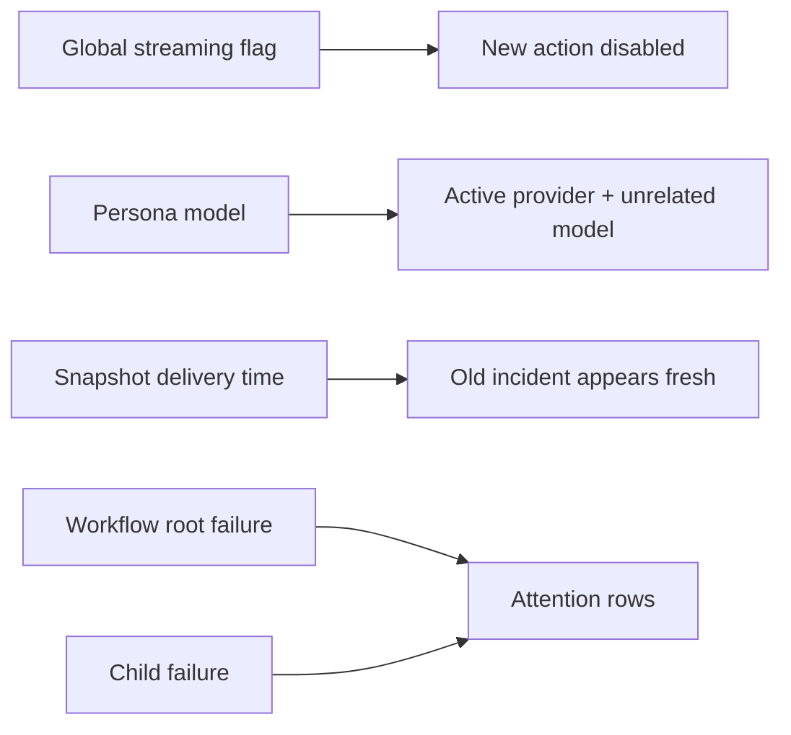
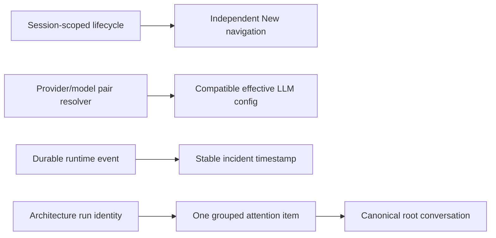
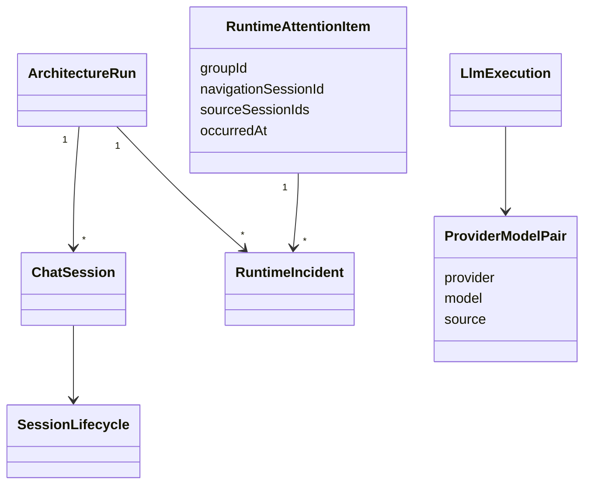

# Demo runtime UX regressions

## Acceptance criteria

- [x] `New` remains available while another chat is streaming; a delayed create response cannot steal selection.
- [x] A workflow resolves provider and model as one compatible pair and reports the effective pair on failure.
- [x] Replayed runtime incidents retain their durable occurrence time and do not become fresh after F5/re-identify.
- [x] One workflow failure produces one attention item with canonical root navigation and child evidence.
- [x] Focused tests, typecheck/build, and manual DEV/QA checks pass.

## Current architecture

## Target architecture

## Models and relations

## Notes

- 2026-07-12: user clarified that the backend-restart notice belonged to an old conversation and surfaced later. The fix must use the durable incident timestamp, not snapshot arrival time.
- Fixed-duration waits are not part of the solution; selection and hydration use explicit lifecycle state.
- Manual QA on `5288` proved two consecutive `New` actions while another turn was active. A real Strategic Decision Council run used Xiaomi rather than CometAPI, terminated as `failed` on provider `401`, left no misleading Finalizer state, and produced one grouped runtime-attention row.
