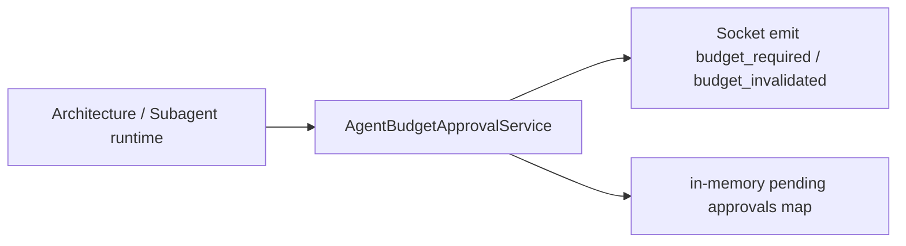
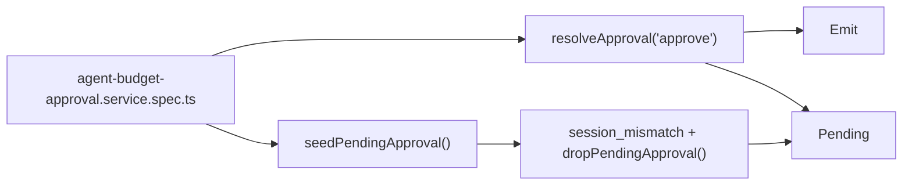
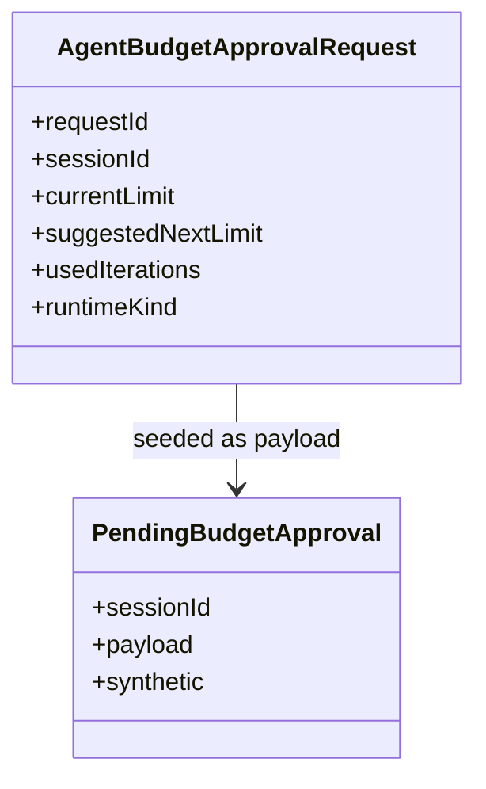

# Test Gap Detection: budget approval runtime paths

## Acceptance criteria

- [x] Confirm a concrete untested path in the latest changed budget-approval area.
- [x] Add minimal tests only in the touched budget-approval service spec.
- [x] Verify the focused spec passes with system Node + Vitest.

## Why this slice

Recent architecture/runtime work added durable and synthetic budget approval
handling paths in `AgentBudgetApprovalService`, but the existing spec only
proved request creation and abort cleanup. Resolve/drop/session-mismatch paths
were still untested.

## Current architecture

## Target verification architecture

## Affected model relations

## Plan

- [x] Add approval-resolution test proving next limit and invalidation payload.
- [x] Add synthetic pending test proving session mismatch does not resolve/remove foreign requests.
- [x] Run focused Vitest spec and record result.

## Notes

- Scope intentionally stays inside `apps/kalio-api/src/modules/chat/__tests__/agent-budget-approval.service.spec.ts`.
- No production refactor needed; this slice is test-gap closure for recent runtime changes.
- Verification: `pnpm exec vitest run src/modules/chat/__tests__/agent-budget-approval.service.spec.ts --reporter=verbose` passed on 2026-07-13 with system Node on PATH.
- Test authoring note: the first draft incorrectly assumed a decision value of `approve`; the actual contract is `allow_one | allow_ten | allow_unlimited | block`, confirmed against `packages/@kalio/types/src/index.ts`.
