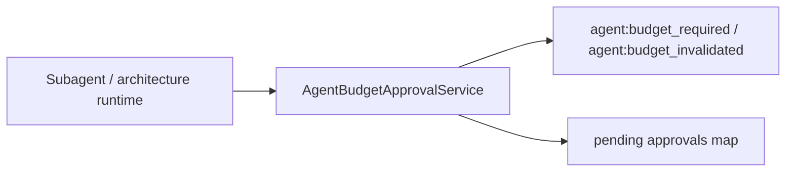
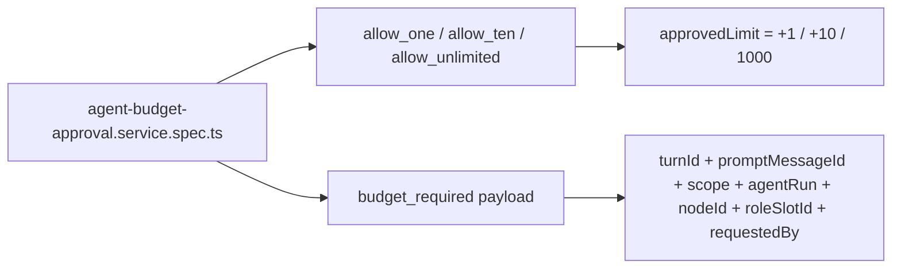
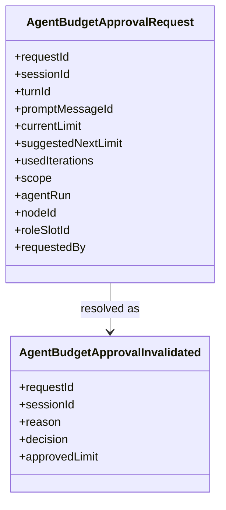

# Test Gap Detection: budget approval service decision edges

## Acceptance criteria

- [x] Confirm a concrete backend test gap from recent budget-approval changes.
- [x] Add only focused regression tests in the existing backend spec file.
- [x] Verify the affected focused suites pass with system Node + Vitest.

## Why this slice

Recent budget-approval work added more approval decisions and richer runtime
payload linkage. The main happy paths are covered, but the service spec still
lacks direct proof for:

- `resolveApproval(..., 'allow_one')`
- `resolveApproval(..., 'allow_unlimited')`
- the emitted `agent:budget_required` payload carrying runtime linkage fields
  like `turnId`, `promptMessageId`, `scope`, `agentRun`, `nodeId`,
  `roleSlotId`, and `requestedBy`

## Current architecture

## Target verification architecture

## Affected model relations

## Plan

- [x] Replace the single `allow_ten` approval test with a focused decision table covering `allow_one`, `allow_ten`, and `allow_unlimited`.
- [x] Assert the emitted `agent:budget_required` payload keeps the full runtime-linkage fields.
- [x] Run the focused backend Vitest spec and record the result.

## Notes

- Scope stays inside `apps/kalio-api/src/modules/chat/__tests__/agent-budget-approval.service.spec.ts` unless a real production defect is exposed.
- Explorer review showed FE hydration paths already have positive coverage; the smaller and higher-value gap is backend decision coverage.
- Verification: `corepack pnpm --filter kalio-api exec vitest run src/modules/chat/__tests__/agent-budget-approval.service.spec.ts --reporter=verbose` passed on 2026-07-15 with system Node on PATH.
- Result: no production change was required; the new coverage confirmed existing `allow_one`, `allow_ten`, and `allow_unlimited` behavior plus runtime-linkage payload fields.
