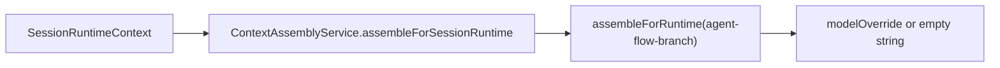
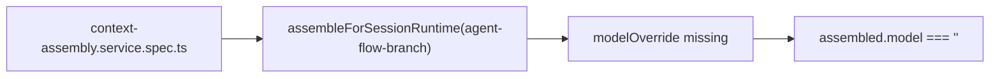
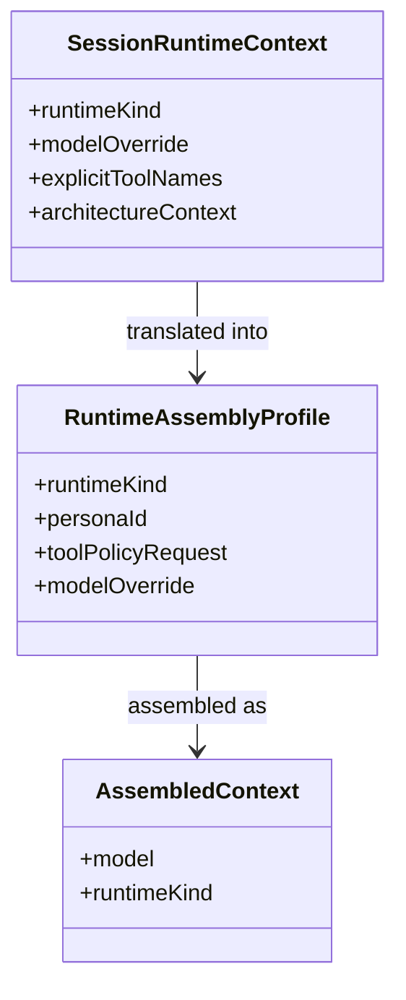

# Test Gap Detection: ContextAssembly branch model fallback

## Acceptance criteria

- [x] Confirm a concrete regression gap in the recent ContextAssembly model-contract changes.
- [x] Add one focused regression test in the existing ContextAssembly spec.
- [x] Verify the focused ContextAssembly spec passes with system Node + Vitest.

## Why this slice

Commit `78ac35fa` added agent-flow branch model-contract tests, but current
coverage proves only the direct `assembleForRuntime(...)` branch path. Runtime
callers use `assembleForSessionRuntime(...)`, and the no-override branch case is
still unpinned there.

## Current architecture

## Target verification architecture

## Affected model relations

## Plan

- [x] Add one `assembleForSessionRuntime(...)` test for `agent-flow-branch` without `modelOverride`.
- [x] Run the focused ContextAssembly spec and record the result.

## Notes

- Scope stays inside `apps/kalio-api/src/modules/chat/context-assembly.service.spec.ts` unless the test exposes a production defect.
- Verification: `corepack pnpm --filter kalio-api exec vitest run src/modules/chat/context-assembly.service.spec.ts --reporter=verbose` passed on 2026-07-15 with system Node on PATH.
- Final combined verification also passed with `corepack pnpm --filter kalio-api exec vitest run src/modules/chat/__tests__/agent-budget-approval.service.spec.ts src/modules/chat/context-assembly.service.spec.ts --reporter=verbose`.
- Result: no production change was required; the added test confirmed the blank-model contract on the real session-runtime path.
