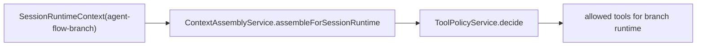
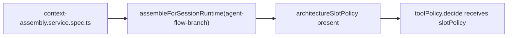
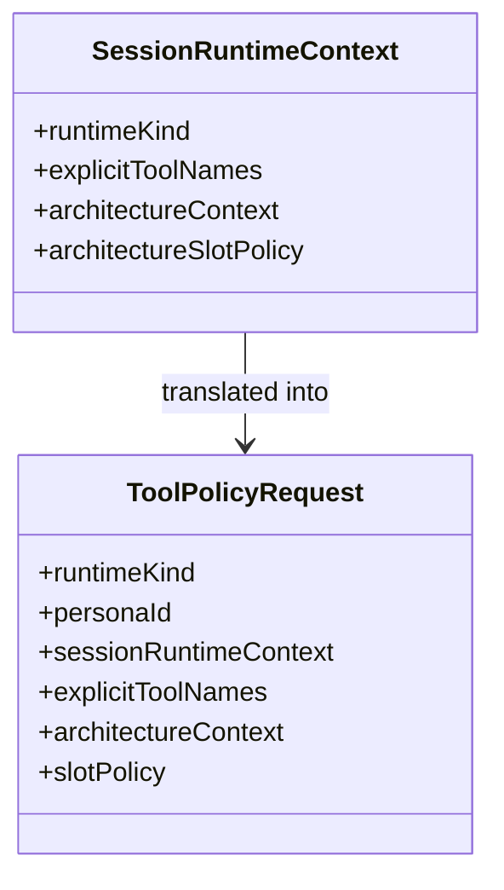

# Test Gap Detection: ContextAssembly branch slot-policy forwarding

## Acceptance criteria

- [x] Confirm one concrete untested path in the recent `ContextAssemblyService` branch-runtime changes.
- [x] Add one focused regression test in the existing ContextAssembly spec.
- [x] Verify the focused ContextAssembly spec passes with system Node + Vitest.

## Why this slice

Current branch-model tests prove only the `modelOverride` contract. They do not
prove that `assembleForSessionRuntime(...)` forwards
`architectureSlotPolicy` into `toolPolicy.decide(...)` for
`agent-flow-branch` runtimes, even though recent runtime wiring depends on that
handoff to keep branch tool access constrained.

## Current architecture

## Target verification architecture

## Affected model relations

## Plan

- [x] Add one test proving `architectureSlotPolicy` is forwarded on the session-runtime branch path.
- [x] Run the focused ContextAssembly spec and record the result.

## Notes

- Scope stays inside `apps/kalio-api/src/modules/chat/context-assembly.service.spec.ts` unless the test exposes a production defect.
- Verification: `corepack pnpm --filter kalio-api exec vitest run src/modules/chat/context-assembly.service.spec.ts --reporter=verbose` passed on 2026-07-15 with system Node on PATH.
- Result: no production change was required; the new test confirms `architectureSlotPolicy` reaches `toolPolicy.decide(...)` on the real session-runtime branch path.
