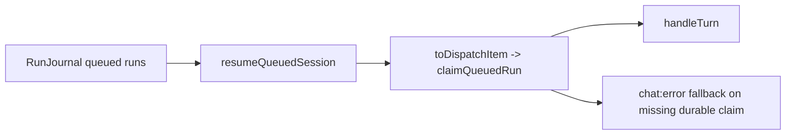
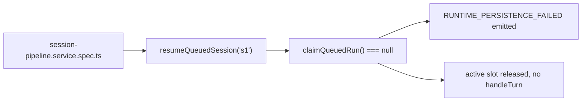
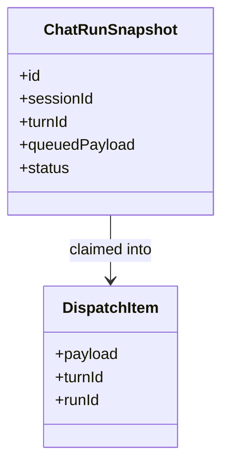

# Test Gap Detection: SessionPipeline null claim recovery

## Acceptance criteria

- [x] Confirm one concrete untested path in recent queued-runtime recovery changes.
- [x] Add one focused regression test in the existing SessionPipeline spec.
- [x] Verify the focused SessionPipeline spec passes with system Node + Vitest.

## Why this slice

`resumeQueuedSession(...)` proves only the happy-path durable resume. It does
not prove the recovery fallback where `claimQueuedRun()` returns `null` after a
durable queue head was discovered, which would otherwise leave the branch
unverified for restart recovery failures.

## Current architecture

## Target verification architecture

## Affected model relations

## Plan

- [x] Add one negative-path test for `claimQueuedRun() === null`.
- [x] Run the focused SessionPipeline spec and record the result.

## Notes

- Scope stays inside `apps/kalio-api/src/modules/chat/__tests__/session-pipeline.service.spec.ts` unless the test exposes a production defect.
- Verification: `corepack pnpm --filter kalio-api exec vitest run src/modules/chat/__tests__/session-pipeline.service.spec.ts --reporter=verbose` passed on 2026-07-15 with system Node on PATH.
- Result: no production change was required; the new test confirms restart recovery emits `RUNTIME_PERSISTENCE_FAILED`, skips `handleTurn`, and releases the active slot when the durable claim disappears.
