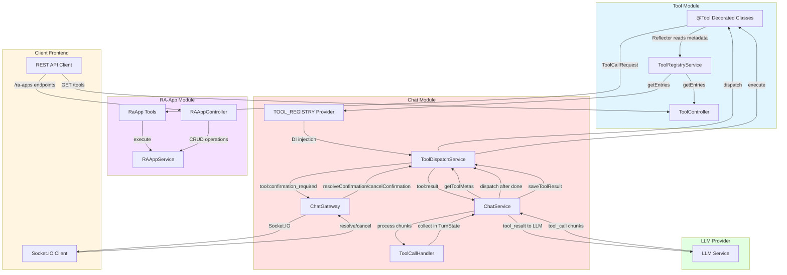
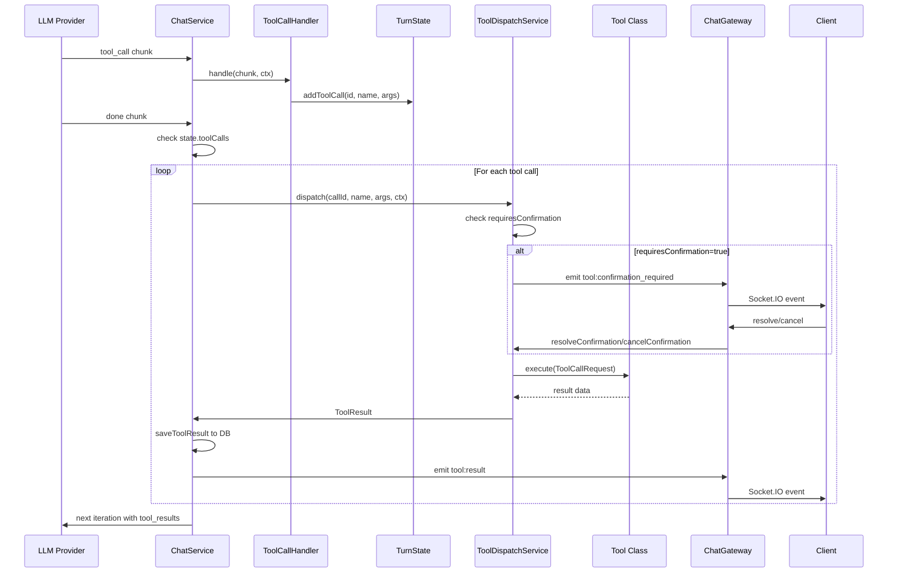

# Tool Architecture

## Overview

This document describes how tools are registered, accessed by the chat core, and executed in the Kalio system.

## Architecture Diagram



## Tool Registration Flow

1. **Tool Definition**: Each tool is a class decorated with `@Tool()` containing:
   - `name`: Tool identifier
   - `description`: What the tool does
   - `parameters`: JSON schema for arguments
   - `requiresConfirmation`: Whether user approval is needed

2. **Metadata Collection**: `ToolRegistryService` constructor:
   - Injects all tool classes via DI
   - Uses NestJS Reflector to read `@Tool()` metadata
   - Creates `ToolEntry` with `meta` and `execute` function
   - Exposes via `getEntries()`

3. **Module Integration**: ChatModule:
   - Imports ToolModule
   - Provides `TOOL_REGISTRY` token using factory
   - Factory calls `ToolRegistryService.getEntries()`
   - Injected into `ToolDispatchService`

## Tool Execution Flow

### 1. LLM Tool Call



### 2. Human-in-the-Loop (HITL) Confirmation

Tools with `requiresConfirmation: true` require user approval:

- Timeout: 30 seconds
- Events:
  - `tool:confirmation_required`: Sent to client with requestId, toolName, args
  - Client responds via Socket.IO with approve/cancel
- If timeout or cancelled: Tool execution skipped, returns `cancelled` status

## RA-App Integration

### As Tools

RA-Apps are exposed as tools that the LLM can invoke:

- `run_raapp`: Execute stored RA-App by ID
- `raapp_create`: Create inline RA-App from HTML/GUI DSL
- `list_raapps`: List available RA-Apps
- `raapp_compile`: Validate GUI DSL in sandbox

### REST API

RA-Apps also have direct REST API access at `/ra-apps`:

- `GET /`: List all RA-Apps
- `GET /:id`: Get specific RA-App details
- `POST /upload`: Upload new RA-App (zip file)
- `DELETE /:id`: Delete user RA-App (core apps protected)

### Interactive Communication

Interactive RA-Apps can send messages back to chat:

```javascript
window.parent.postMessage({
  type: "kalio_send_message",
  content: "user answer"
}, "*");
```

## Tool Categories

### VFS Tools
- `vfs_write`: Write to virtual file system
- `vfs_read`: Read from virtual file system
- `vfs_list`: List virtual file system contents

### Filesystem Tools
- `fs_read`: Read from real filesystem
- `fs_write`: Write to real filesystem
- `fs_list`: List real filesystem contents

### Key-Value Tools
- `kv_write`: Write to KV store
- `kv_read`: Read from KV store
- `kv_list`: List KV store keys
- `kv_delete`: Delete from KV store

### Search Tools
- `grep_search`: Search files with regex
- `file_search`: Search files by name

### Terminal Tools
- `terminal_spawn`: Spawn terminal process
- `terminal_list`: List running terminals
- `terminal_output`: Get terminal output
- `terminal_kill`: Kill terminal process

### Memory Tools
- `memory_ingest`: Ingest data to memory
- `memory_search`: Search memory
- `memory_ingest_conversation`: Ingest conversation to memory

### Subagent Tool
- `subagent`: Spawn subagent for delegated tasks

## Persona-Based Tool Filtering

Tools can be filtered by persona configuration:

- Persona config has `availableSkills` array
- If empty: All tools available
- If populated: Only tools with matching names available
- Filtered tool list sent via `chat:context` event

## Security Considerations

1. **Confirmation Required**: Dangerous tools (fs_write, terminal_spawn, etc.) require user approval
2. **Timeout Protection**: HITL confirmation times out after 30 seconds
3. **Core App Protection**: Core RA-Apps cannot be deleted via API
4. **Sandbox Execution**: GUI DSL compiled in isolated VM (RAAppSandboxService)
5. **Abort Support**: All tool calls respect AbortController for user interruption
