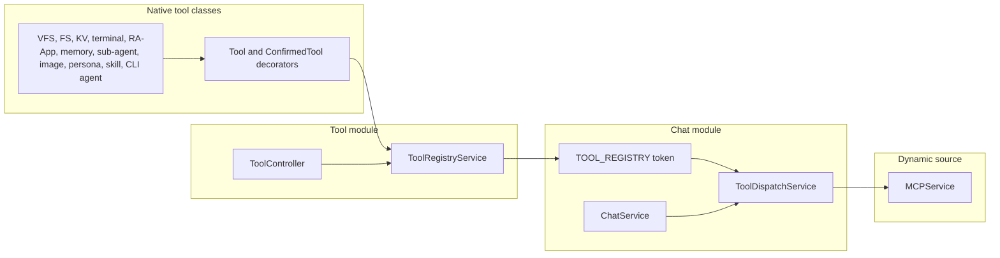
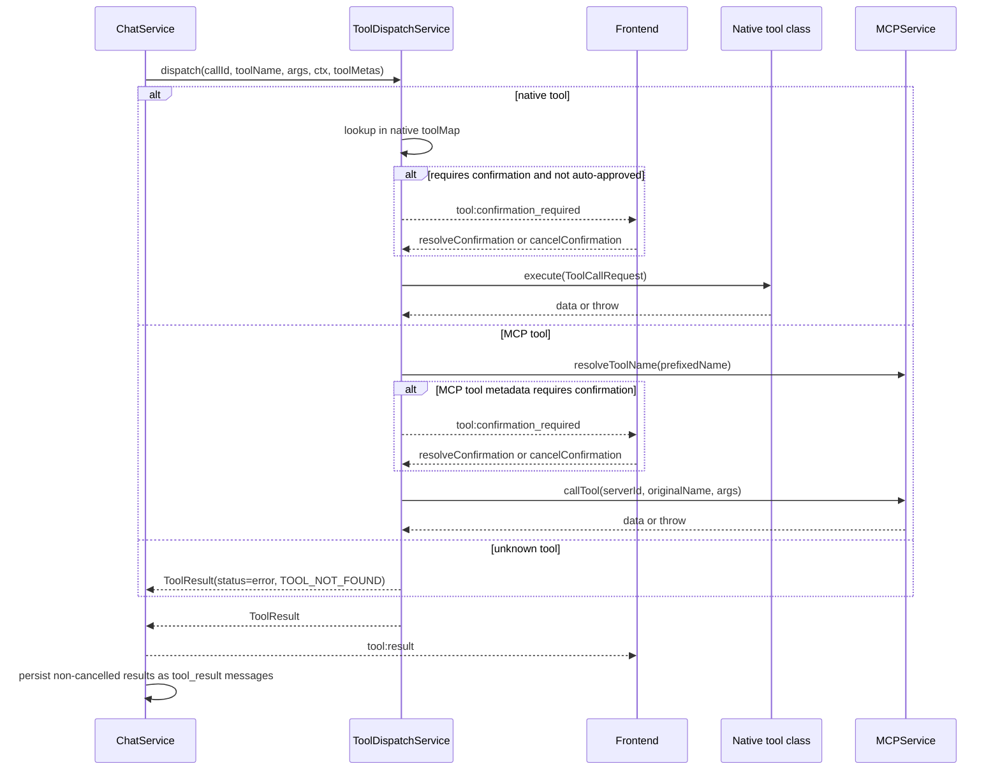
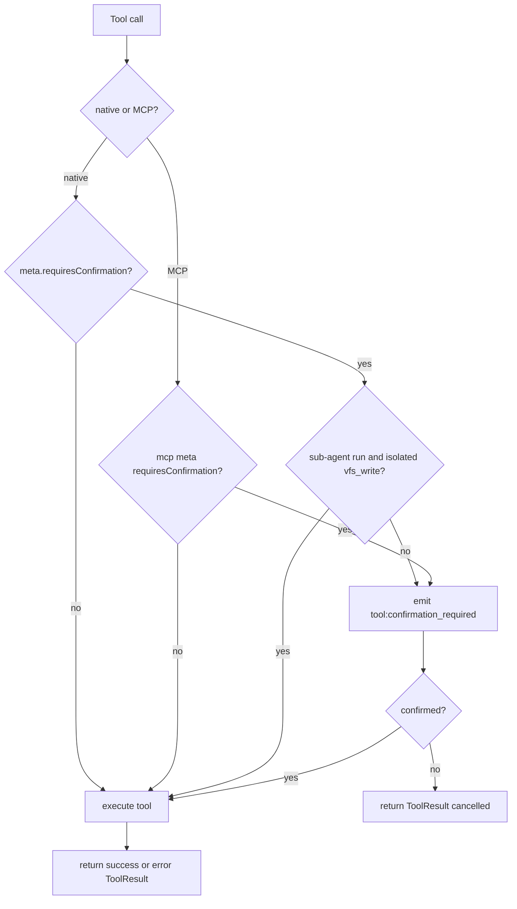

# Tool Architecture

This document describes how tools are registered, filtered, confirmed, executed, and persisted in the current Kalio runtime.
For the wider system map, see `application-architecture-current.md`.

## Source of truth components

| Component | Current responsibility |
| --- | --- |
| `ToolRegistryService` | Reads `@Tool()` and `@ConfirmedTool()` metadata from native tool classes and exposes a typed registry |
| `ToolDispatchService` | Merges native and MCP tool metadata, handles confirmation, dispatches calls, and returns `ToolResult` |
| `ChatService` | Emits `tool:start`, calls dispatch, emits `tool:result`, and persists non-cancelled results into history |
| `MCPService` | Dynamic external tool source used in addition to native tools |
| `SubagentRuntimeService` | Handles child-session execution when sub-agent tools delegate work |
| `ToolModule` | Wires concrete native tool classes into Nest DI |
| `ToolController` | Exposes REST-level tool listing and admin surfaces |

## Current native tool families

| Family | Representative tools | Primary surface touched |
| --- | --- | --- |
| Session VFS | `vfs_write`, `vfs_read`, `vfs_list`, VFS search helpers | Session-scoped files under the active VFS session |
| Local filesystem and search | `fs_read`, `fs_list`, `fs_write`, `grep_search`, `file_search` | Allowed host paths |
| Session KV | `kv_write`, `kv_read`, `kv_list`, `kv_delete` | Per-session persistent KV store |
| Terminal | `terminal_spawn`, `terminal_list`, `terminal_output`, `terminal_kill` | Host processes with session-aware UI state |
| RA-App | `raapp_create`, `raapp_compile`, `run_raapp`, `list_raapps` | RA-App catalog and inline render path |
| Memory | `memory_ingest`, `memory_search`, `memory_ingest_conversation` | Persona-scoped long-term memory |
| Sub-agent | `run_subagent`, `spawn_subagent`, `message_subagent` | Child chat sessions and optional VFS copy-back |
| Image | `image_generate`, `image_edit`, `image_view` | Session VFS plus provider-backed image APIs |
| CLI agent | `run_cli_agent` | External coding-agent process execution |
| Metadata and discovery | `list_tools`, `get_tool_details` | LLM tool self-discovery |
| Settings models | `skill_*`, `persona_*` | Persistent DB-backed configuration |
| Web search | `web_search` | Provider-backed network search |

## Registration path

Every native tool is a Nest provider class decorated with `@Tool(...)` or `@ConfirmedTool(...)`.
`ToolRegistryService` receives all tool instances through DI, reads their decorator metadata via `Reflector`, and turns them into registry entries that `ChatModule` injects into `ToolDispatchService` through the `TOOL_REGISTRY` token.

Important practical details:

- The registry is static for native tools and dynamic for MCP tools.
- `setOverride(toolName, requiresConfirmation)` mutates the in-memory metadata object directly, so confirmation policy changes are visible immediately to `ToolDispatchService`.
- `@ConfirmedTool(...)` exists to make persistent or destructive tool policy easier to apply consistently.

## Runtime models

| Model | Fields that matter most at runtime |
| --- | --- |
| `ToolMeta` | `name`, `description`, `parameters`, `requiresConfirmation` |
| `ToolCallRequest` | `sessionId`, `vfsSessionId`, `callId`, `args`, `availableTools`, `agentRun`, `_emit` |
| `ToolConfirmationRequest` | `requestId`, `toolCallId`, `sessionId`, `toolName`, `args`, `timeoutMs`, `agentRun` |
| `ToolResult` | `callId`, `status`, `data`, `errorCode`, `errorMessage`, optional `sessionId`, `toolName`, `agentRun` |

Two fields deserve special attention:

- `vfsSessionId` lets a tool operate either in the parent session VFS or in an isolated child VFS during sub-agent runs.
- `_emit` lets long-running tools stream progress events before the final `tool:result` arrives. `run_cli_agent` uses this for `cli_agent:progress`.

## Dispatch sequence

What `ToolDispatchService` does beyond simple routing:

- binds pending confirmations to both `requestId` and `sessionId`
- applies the same confirmation gate to MCP tools if their metadata says so
- enriches sub-agent results with `sessionId`, `toolName`, and `agentRun`
- converts thrown executor errors into structured `ToolResult(status='error')`

## Confirmation policy and auto-approval

Current rules from the code:

- Pending confirmations live in `ToolDispatchService.pending` and are keyed by generated `requestId` plus bound `sessionId`.
- `ChatGateway` rejects `tool:confirm` and `tool:cancel` if the socket does not currently own the session.
- The only built-in auto-approve special case is `vfs_write` during a sub-agent run when:
  - `agentRun.agentType === 'subagent'`
  - `agentRun.vfsMode === 'isolated'`
  - `ctx.vfsSessionId === ctx.sessionId`
- Sub-agent confirmation requests currently use `timeoutMs = 0`; the runtime is optimized around isolated child writes being auto-approved rather than timing out.

## Persistence and UI consequences

Tool execution is not finished when the executor returns.
The runtime does a few more things that shape the UI and history model:

1. `ChatService` emits `tool:start` before dispatch so the UI can open a live tool chip.
2. `ToolDispatchService` returns a structured `ToolResult` instead of throwing through the socket layer.
3. `ChatService` emits `tool:result` immediately after dispatch finishes.
4. For every non-cancelled result, `ChatService` persists a `tool_result` message into session history.
5. `ChatInterface` also mirrors successful results into `sessionStore` immediately so the chat UI does not need to wait for a REST reload.

That leads to an important split:

- `ToolActivity` is live UI state.
- `tool_result` messages are durable history.

## Tool filtering

Filtering happens before the LLM sees the tool list, not inside individual tool executors.

Current behavior in `ChatService.filterTools(...)`:

- native tools are filtered by `persona.allowedTools`
- MCP tools are filtered by `persona.mcpPolicy`
- when `mcpPolicy === 'allow_list'`, MCP tool visibility is also driven by the concrete tool names present in `persona.allowedTools`

This means tool visibility is a session-level orchestration concern, while tool execution remains a dispatch concern.

## Current invariants worth preserving

- Tool names must be unique across the merged native and MCP tool set exposed to the model.
- A cancelled tool should still produce a visible `ToolResult`, but it must not be persisted as a `tool_result` message.
- Confirmation enforcement must stay session-bound in both the gateway and dispatch layer.
- Any tool that streams progress should use `_emit` and still end with a normal `ToolResult`.
- New mutating tools should prefer `@ConfirmedTool(...)` unless there is a deliberate reason not to use it.