# Kalio UI IA Map

Source pack: [README](./README.md)  
Thumbnail gallery: [gallery.html](./gallery.html)  
Preferred richer runtime pack: [historical rich state](../rich-state-historical-2026-06-27T19-49-07-933Z/README.md)

## Scope

This map covers the full shell-level IA captured in the base screenshot pack:

- `Landing`
- `Talk`
- `Tools`
- `Mind`
- `Architect`
- `Observability`
- `Settings`

## Top-Level Structure

```mermaid
flowchart TD
  APP["Kalio App"] --> LANDING["Landing"]
  APP --> TALK["Talk"]
  APP --> TOOLS["Tools"]
  APP --> MIND["Mind"]
  APP --> ARCH["Architect"]
  APP --> OBS["Observability"]
  APP --> SETTINGS["Settings"]

  LANDING --> LANDING_SHOT["01-home-landing.png"]

  TALK --> TALK_CONV["Conversation"]
  TALK --> TALK_GRAPH["Execution Graph"]
  TALK --> TALK_RUNS["Active Agent Runs"]
  TALK_CONV --> SHOT02["02-talk-conversation.png"]
  TALK_GRAPH --> SHOT03["03-talk-execution-graph.png"]
  TALK_RUNS --> SHOT04["04-talk-active-agent-runs.png"]

  TOOLS --> TOOLS_NATIVE["Native"]
  TOOLS --> TOOLS_MCP["MCP"]
  TOOLS --> TOOLS_RAAPP["RAApp"]
  TOOLS_NATIVE --> SHOT05["05-tools-native.png"]
  TOOLS_MCP --> SHOT06["06-tools-mcp.png"]
  TOOLS_RAAPP --> SHOT07["07-tools-raapp.png"]

  MIND --> MIND_MEMORY["Memory"]
  MIND --> MIND_FILES["Files"]
  MIND --> MIND_SKILLS["Skills"]
  MIND --> MIND_PERSONAS["Personas"]
  MIND_MEMORY --> SHOT08["08-mind-memory.png"]
  MIND_FILES --> SHOT09["09-mind-files.png"]
  MIND_SKILLS --> SHOT10["10-mind-skills.png"]
  MIND_PERSONAS --> SHOT11["11-mind-personas.png"]

  ARCH --> SHOT12["12-architect.png"]
  OBS --> SHOT13["13-observability.png"]
```

## Settings Tabs

```mermaid
flowchart TD
  SETTINGS["Settings Modal"] --> LLM["LLM"]
  SETTINGS --> RUNTIME["Runtime"]
  SETTINGS --> CONVO["Conversation"]
  SETTINGS --> HITL["HITL"]
  SETTINGS --> AUDIT["Audit Retention"]
  SETTINGS --> EMBED["Embeddings"]
  SETTINGS --> SEARCH["Web Search"]
  SETTINGS --> IMAGE["Image Generation"]
  SETTINGS --> CLI["CLI Agents"]
  SETTINGS --> MCP["MCP Servers"]
  SETTINGS --> PATHS["Allowed Paths"]
  SETTINGS --> TELEGRAM["Telegram"]

  LLM --> SHOT14["14-settings-llm.png"]
  RUNTIME --> SHOT15["15-settings-runtime.png"]
  CONVO --> SHOT16["16-settings-conversation.png"]
  HITL --> SHOT17["17-settings-hitl.png"]
  AUDIT --> SHOT18["18-settings-audit-retention.png"]
  EMBED --> SHOT19["19-settings-embeddings.png"]
  SEARCH --> SHOT20["20-settings-web-search.png"]
  IMAGE --> SHOT21["21-settings-image-generation.png"]
  CLI --> SHOT22["22-settings-cli-agents.png"]
  MCP --> SHOT23["23-settings-mcp-servers.png"]
  PATHS --> SHOT24["24-settings-allowed-paths.png"]
  TELEGRAM --> SHOT25["25-settings-telegram.png"]
```

## Screenshot Index

| Section | Tab / view | Screenshot |
| --- | --- | --- |
| Landing | Home | [01-home-landing.png](./01-home-landing.png) |
| Talk | Conversation | [02-talk-conversation.png](./02-talk-conversation.png) |
| Talk | Execution Graph | [03-talk-execution-graph.png](./03-talk-execution-graph.png) |
| Talk | Active Agent Runs | [04-talk-active-agent-runs.png](./04-talk-active-agent-runs.png) |
| Tools | Native | [05-tools-native.png](./05-tools-native.png) |
| Tools | MCP | [06-tools-mcp.png](./06-tools-mcp.png) |
| Tools | RAApp | [07-tools-raapp.png](./07-tools-raapp.png) |
| Mind | Memory | [08-mind-memory.png](./08-mind-memory.png) |
| Mind | Files | [09-mind-files.png](./09-mind-files.png) |
| Mind | Skills | [10-mind-skills.png](./10-mind-skills.png) |
| Mind | Personas | [11-mind-personas.png](./11-mind-personas.png) |
| Architect | Main editor | [12-architect.png](./12-architect.png) |
| Observability | Main page | [13-observability.png](./13-observability.png) |
| Settings | LLM | [14-settings-llm.png](./14-settings-llm.png) |
| Settings | Runtime | [15-settings-runtime.png](./15-settings-runtime.png) |
| Settings | Conversation | [16-settings-conversation.png](./16-settings-conversation.png) |
| Settings | HITL | [17-settings-hitl.png](./17-settings-hitl.png) |
| Settings | Audit Retention | [18-settings-audit-retention.png](./18-settings-audit-retention.png) |
| Settings | Embeddings | [19-settings-embeddings.png](./19-settings-embeddings.png) |
| Settings | Web Search | [20-settings-web-search.png](./20-settings-web-search.png) |
| Settings | Image Generation | [21-settings-image-generation.png](./21-settings-image-generation.png) |
| Settings | CLI Agents | [22-settings-cli-agents.png](./22-settings-cli-agents.png) |
| Settings | MCP Servers | [23-settings-mcp-servers.png](./23-settings-mcp-servers.png) |
| Settings | Allowed Paths | [24-settings-allowed-paths.png](./24-settings-allowed-paths.png) |
| Settings | Telegram | [25-settings-telegram.png](./25-settings-telegram.png) |

## Rich-State Coverage

The base pack is good for shell-level IA. For non-empty runtime examples, use:

- [Historical rich state pack](../rich-state-historical-2026-06-27T19-49-07-933Z/README.md)
- [Raw live-state pack](../rich-state-2026-06-27T19-44-10-640Z/README.md)
