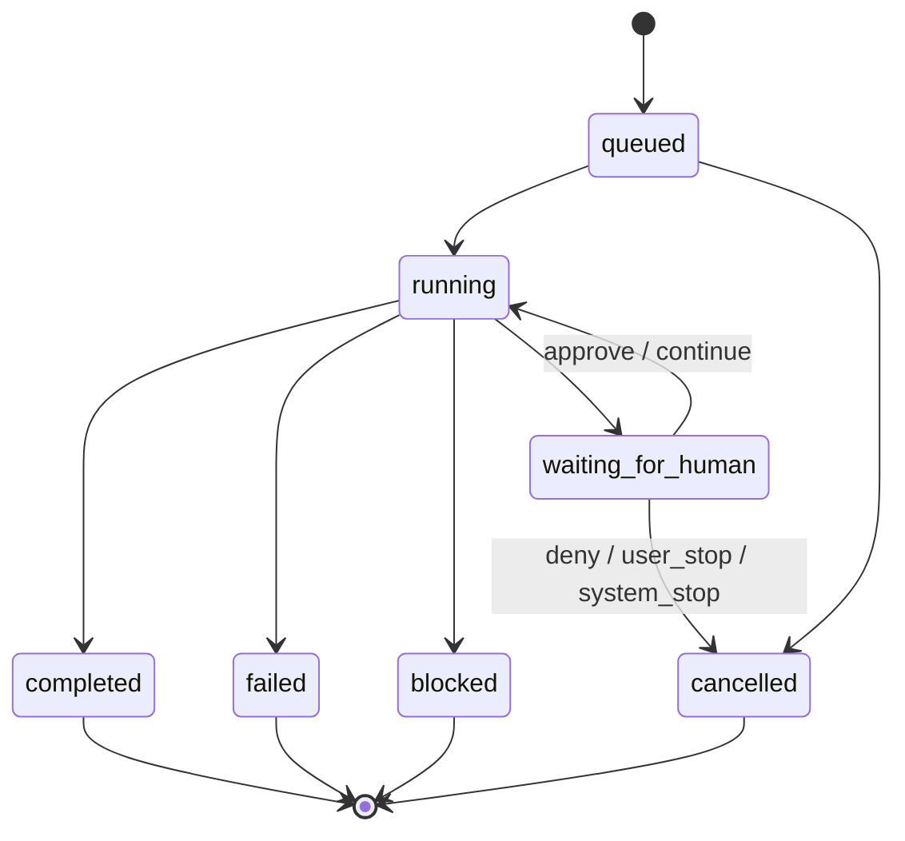
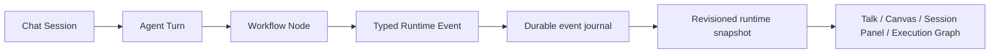
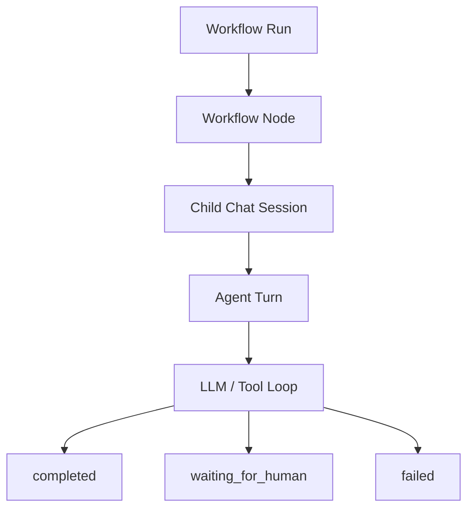
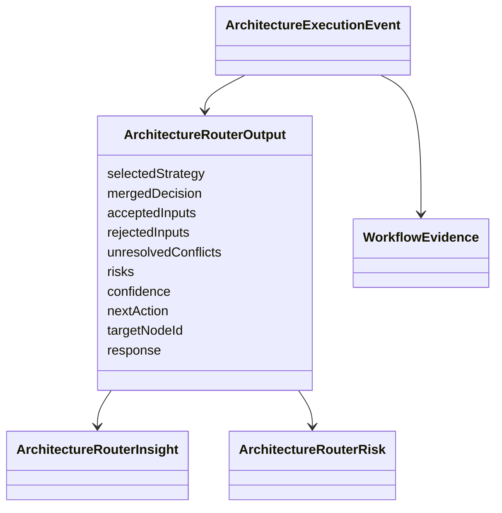

# Kalio Project Spec

Last updated: 2026-07-10

This file records durable product and architecture decisions that should guide agents across sessions. Session notes in `docs/sessions/` describe what changed; this file describes the boundaries that should remain true.

## Runtime Source Of Truth

- Backend durable runtime state is the source of truth for chat, workflow, AgentFlow, CLI children, tool approvals, HITL, and reconnect/F5 recovery.
- Frontend may render projections, but it must not infer runtime routing, terminal state, retryability, or approvals from prose, prompt text, message ids, tool-call id prefixes, or UI-local timers.
- Runtime decisions use typed status, reason code, error code, evidence, structured output, and durable event history.
- Display text can explain a decision, but changing display text must not change system behavior.

## Canonical Runtime Contract

- A workflow run is an append-only, durable sequence of typed runtime events. Each event has a run id, monotonically increasing sequence, event id, timestamp, correlation ids (`sessionId`, `turnId`, `nodeId`, `toolCallId`, or `waitId` where applicable), lifecycle status, and typed reason/error fields.
- The backend commits an event before publishing its projection. REST recovery and Socket.IO publish the same complete, versioned snapshot. Incremental chunks are display overlays and cannot mutate lifecycle status.
- The frontend accepts a runtime snapshot only when it has a greater server-authoritative `revision` than its stored projection. A terminal status cannot regress to non-terminal state within a run.
- Workflow, node, chat-turn, child execution, and HITL waits project from durable records. UI-local `done`, message order, clock time, id patterns, and transcript content are never lifecycle sources.

- Every terminal state has a typed `reasonCode`; failed states additionally carry `errorCode` or `failure`.
- Manual tool, RA-App, and budget approvals are durable unbounded waits. They end only through an explicit decision, a user/system stop, or typed workflow cancellation.

## Chat And Workflow Model

- Provider and model form one execution pair. An AgentFlow persona must not silently replace only the model on an unrelated active provider. Without an explicit run-level model override, workflow branches inherit the active provider configuration used by chat.

- A chat is composed of turns. The canonical run lifecycle is `queued`, `running`, `waiting_for_human`, `completed`, `failed`, `blocked`, or `cancelled`; unknown or legacy status must not be projected as success.
- The latest active/terminal turn influences the chat status, but chat-level recovery may retry transport/provider failures through typed policy.
- Workflow nodes call child chat sessions; child sessions execute turns. Nodes and connections orchestrate at a higher level and must consume child typed states, not child transcript prose.
- CLI agents, subagents, and AgentFlow children are one child-execution family for lifecycle, visibility, stop, replay, and status projection.
- Terminal events are scoped to their `runId` and `turnId`; a terminal event for an older turn must not complete or clear a newer turn.

## Structured Output And Handoff

- Router, judge, and finalizer control flow must prefer provider-native structured output/schema.
- If a model must return a decision, use structured output. Do not parse `message.includes`, prose JSON blocks, or status words from assistant text.
- Router/parent nodes pass downstream context as typed handoff packets derived from `ArchitectureRouterOutput`: target, action, confidence, accepted inputs, rejected inputs, conflicts, risks, and response.
- `routerOutput.nextAction` is the control contract. Only `route_to` may become a downstream route call; `ask_human` and other pause actions may keep `targetNodeId` as context, but must not emit route hops or selected downstream nodes.
- A visible handoff bubble is display-only. The actual route is selected from typed `routerOutput` and graph edges.

## LLM History Boundaries

- Persisted conversation history remains complete for UI, audit, and recovery, including prompts whose turns failed or were cancelled.
- Provider context excludes every message owned by a terminal `failed`, `cancelled`, or `interrupted` chat run. Selection uses the durable `turnId -> chat_runs.status` relation; text, message wording, and elapsed time are forbidden inputs.
- `completed`, active, `waiting_for_human`, and safely recoverable turns remain eligible for provider context. Legacy messages without a durable `turnId` remain visible through the compatibility path until migrated.
- A later successful turn must never answer unresolved prompts from terminal failed turns or attach those answers to the new turn's `promptMessageId`.
- Persona/slot model selection is a request-scoped override of the active credential model. Paid readiness must prove the effective model used by the tested persona/slot, not only the global credential model.

## Durable Chat Queue

- A queued chat turn is persisted before `chat:queued` is emitted.
- Queue identity remains stable across enqueue, dequeue, restart, and execution: `runId`, `turnId`, and `clientMessageId` are not regenerated.
- Dequeue is a compare-and-swap transition from `queued` to `active`; FIFO order is durable and deterministic.
- Session identification bootstraps pending queued turns from the backend journal. Fixed-duration waits are not a recovery mechanism.
- Unknown or legacy lifecycle values never project as success; they remain unresolved until explicitly mapped.

## HITL And Budgets

- Manual HITL waits are durable and do not expire by timeout. They end only by approve, deny, explicit user/system stop, or workflow cancellation.
- Tool confirmation state and its typed continuation cursor must survive backend process restart. Approval uses CAS before dispatch, commits one durable tool result, and resumes the same turn and iteration budget; denial uses CAS and cannot leave an orphaned pending request.
- Chat and subagent continuations share the typed cursor contract, but a chat journal `runId` must not be fabricated for subagent runtime. Runtime-specific journal behavior is selected from `runtimeKind`.
- A resumed child turn is not sufficient proof that its parent workflow resumed. Parent orchestration must persist an explicit wait id and graph continuation cursor; after restart it must continue from the waiting node exactly once rather than recreate the child or restart root nodes.
- Human approval and tool-budget requests emitted by a workflow child create a typed `runtime_pause` continuation for the active parent node. Recovery must claim the persisted AgentFlow snapshot with a revision lease before doing work.
- A recovery lease provides single-owner execution, not side-effect exactly-once. Parent recovery must not replay an active node until the child turn result is durably addressable by a stable idempotency identity; replaying the root graph or starting a second child turn is forbidden.
- A child HITL continuation carries `requestId`, `childSessionId`, `childTurnId`, and `promptMessageId`. Completed subagent turns persist their text, structured output, and terminal message id in the chat-run journal; parent replay consumes that outcome by child turn id before any LLM call.
- Parent recovery uses two deterministic triggers: a bootstrap scan for outcomes committed while offline and an in-process completed-turn journal event for outcomes committed after startup. Fixed-duration polling is not a runtime mechanism; revision lease CAS elects one recovery owner.
- Tool budget exhaustion is a typed HITL request. It must appear from durable runtime evidence after reload/reconnect, not only from live socket timing.
- Need Attention should prioritize active approvals before historical notices.
- Live budget/HITL verification must use tools actually exposed to the tested node. A test must not prompt for hidden tools and then treat the model's refusal as a runtime failure.

## QA And Release Boundaries

- No release-ready claim without focused regressions, typecheck/build where affected, and FE-first workflow proof.
- Fixed waits are not architecture fixes. Tests may use bounded waits only as diagnostics or web-first waiting; production runtime correctness must use typed state, explicit lifecycle events, durable snapshots, or ack/drain barriers.
- Live-provider proof must use system Node on Windows and record effective provider/model evidence.
