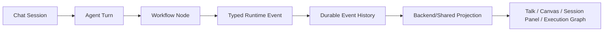
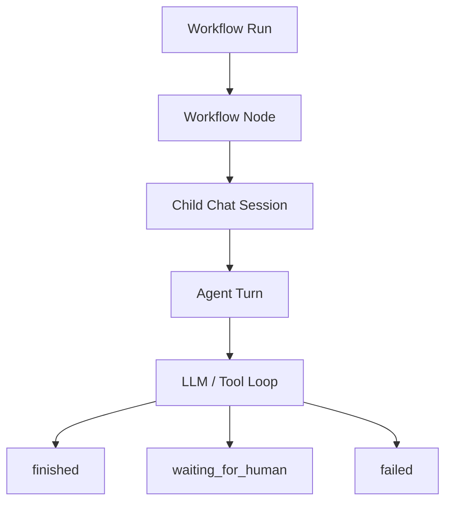
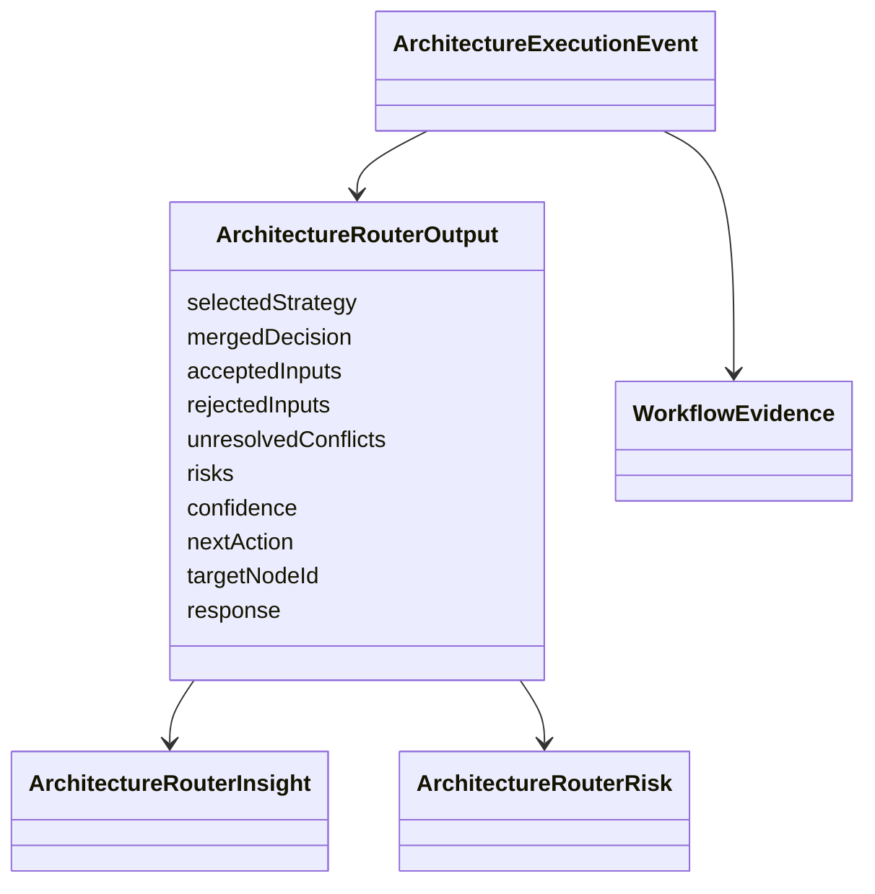

# Kalio Project Spec

Last updated: 2026-07-05

This file records durable product and architecture decisions that should guide agents across sessions. Session notes in `docs/sessions/` describe what changed; this file describes the boundaries that should remain true.

## Runtime Source Of Truth

- Backend durable runtime state is the source of truth for chat, workflow, AgentFlow, CLI children, tool approvals, HITL, and reconnect/F5 recovery.
- Frontend may render projections, but it must not infer runtime routing, terminal state, retryability, or approvals from prose, prompt text, message ids, tool-call id prefixes, or UI-local timers.
- Runtime decisions use typed status, reason code, error code, evidence, structured output, and durable event history.
- Display text can explain a decision, but changing display text must not change system behavior.

## Chat And Workflow Model

- A chat is composed of turns. A turn can be `running`, `finished`, `waiting_for_human`, `failed`, or `cancelled`.
- The latest active/terminal turn influences the chat status, but chat-level recovery may retry transport/provider failures through typed policy.
- Workflow nodes call child chat sessions; child sessions execute turns. Nodes and connections orchestrate at a higher level and must consume child typed states, not child transcript prose.
- CLI agents, subagents, and AgentFlow children are one child-execution family for lifecycle, visibility, stop, replay, and status projection.

## Structured Output And Handoff

- Router, judge, and finalizer control flow must prefer provider-native structured output/schema.
- If a model must return a decision, use structured output. Do not parse `message.includes`, prose JSON blocks, or status words from assistant text.
- Router/parent nodes pass downstream context as typed handoff packets derived from `ArchitectureRouterOutput`: target, action, confidence, accepted inputs, rejected inputs, conflicts, risks, and response.
- `routerOutput.nextAction` is the control contract. Only `route_to` may become a downstream route call; `ask_human` and other pause actions may keep `targetNodeId` as context, but must not emit route hops or selected downstream nodes.
- A visible handoff bubble is display-only. The actual route is selected from typed `routerOutput` and graph edges.

## HITL And Budgets

- Manual HITL waits are durable and do not expire by timeout. They end only by approve, deny, explicit user/system stop, or workflow cancellation.
- Tool budget exhaustion is a typed HITL request. It must appear from durable runtime evidence after reload/reconnect, not only from live socket timing.
- Need Attention should prioritize active approvals before historical notices.
- Live budget/HITL verification must use tools actually exposed to the tested node. A test must not prompt for hidden tools and then treat the model's refusal as a runtime failure.

## QA And Release Boundaries

- No release-ready claim without focused regressions, typecheck/build where affected, and FE-first workflow proof.
- Fixed waits are not architecture fixes. Tests may use bounded waits only as diagnostics or web-first waiting; production runtime correctness must use typed state, explicit lifecycle events, durable snapshots, or ack/drain barriers.
- Live-provider proof must use system Node on Windows and record effective provider/model evidence.
